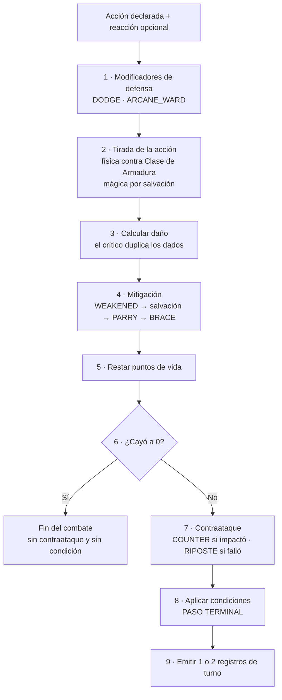

# Build Arena API

API de duelos por turnos entre builds, con el combate resuelto íntegramente en el servidor y transmitido en tiempo real por WebSocket.

Cuarto Proyecto Integrador — Integratec, agosto 2026.
Autor: **Agustín Tabarcache**

---

## La idea

Los jugadores arman *builds* repartiendo un presupuesto fijo de puntos entre cuatro atributos y eligiendo un kit de habilidades. Después se desafían y pelean por turnos.

Todo lo que decide el resultado —las tiradas de dados, el cálculo de daño, los críticos, de quién es el turno y si una build es legal— **se resuelve en el servidor**. El cliente solo declara intención: nunca calcula, nunca valida, nunca decide.

Esa es la premisa del proyecto: *si el cliente puede calcularlo, el cliente puede mentirlo.*

---

## Estado

En desarrollo. La API está desplegada, con el modelo de datos migrado, el catálogo de habilidades cargado, la autenticación funcionando de punta a punta y el motor de combate terminado y cubierto por tests.

| Fase | Estado |
| --- | --- |
| 0 — Fundación | Completa |
| 1 — Persistencia | Completa |
| 2 — Autenticación y seguridad | Completa |
| 3 — Motor de combate | Completa |
| 4 — Builds y catálogo | Pendiente |
| 5 — Social y desafíos | Pendiente |
| 6 — Tiempo real | Pendiente |
| 7 — Rating y cierre | Pendiente |

---

## Tecnologías

| Rol | Herramienta |
| --- | --- |
| Framework | NestJS 11 + TypeScript |
| ORM y base de datos | Prisma 7 + PostgreSQL |
| Autenticación | `@nestjs/jwt` y `passport-jwt` (access + refresh) |
| Hasheo | `bcrypt` |
| Validación | `class-validator` y `class-transformer` |
| Seguridad | `helmet`, CORS, `@nestjs/throttler` |
| Tiempo real | WebSocket |
| Documentación | Scalar sobre OpenAPI |

---

## Instalación

Requiere Node 22 o superior, `pnpm` y una base PostgreSQL accesible.

```bash
pnpm install
cp .env.example .env
pnpm db:migrate
pnpm db:seed
pnpm start:dev
```

La API queda en `http://localhost:3000`.

`db:migrate` aplica las migraciones y genera el cliente de Prisma; `db:seed` carga el catálogo de habilidades. El seed es idempotente: correrlo de nuevo actualiza las filas existentes en lugar de duplicarlas.

> **Nunca uses la base de producción para desarrollar.** El proyecto usa dos bases distintas: un branch de desarrollo y uno de producción en Neon.

---

## Variables de entorno

Están declaradas sin valores en `.env.example`. `.env` nunca se commitea.

| Variable | Descripción |
| --- | --- |
| `PORT` | Puerto de escucha |
| `APP_VERSION` | Versión reportada por `/health` |
| `DATABASE_URL` | Cadena de conexión a PostgreSQL |
| `JWT_SECRET` | Secreto de firma del access token |
| `JWT_ACCESS_EXPIRES_IN` | Vigencia del access token |
| `JWT_REFRESH_SECRET` | Secreto de firma del refresh token |
| `JWT_REFRESH_EXPIRES_IN` | Vigencia del refresh token |
| `CORS_ORIGIN` | Orígenes permitidos, separados por coma. Si está vacía, CORS queda cerrado |
| `THROTTLE_TTL` | Ventana del limitador de peticiones, en milisegundos. Por defecto `60000` |
| `THROTTLE_LIMIT` | Peticiones permitidas por ventana. Por defecto `100` |

---

## Scripts

```bash
pnpm start:dev      # desarrollo con recarga
pnpm build          # genera el cliente de Prisma y compila a dist
pnpm start:prod     # ejecución de la compilación
pnpm lint           # eslint con corrección automática
pnpm test           # tests unitarios
pnpm test:e2e       # tests de extremo a extremo (requieren base de datos)

pnpm db:migrate     # crea y aplica una migración en desarrollo
pnpm db:deploy      # aplica migraciones pendientes en producción
pnpm db:generate    # regenera el cliente de Prisma
pnpm db:seed        # carga el catálogo de habilidades
pnpm db:studio      # explorador visual de la base
```

`db:migrate` solo va en desarrollo: puede resetear la base. En producción corre `db:deploy`, que aplica lo que ya existe y nunca genera migraciones nuevas.

---

## Endpoints

La referencia interactiva se sirve en [`/reference`](https://build-arena-api.onrender.com/reference), generada con Scalar a partir del documento OpenAPI que `@nestjs/swagger` arma con los decoradores de los DTOs y los controllers.

Todas las rutas exigen un access token salvo las marcadas con `@Public()`. En la referencia se prueban con el botón de autenticación, pegando el `accessToken` que devuelve `/auth/login`.

| Método | Ruta | Descripción | Estado |
| --- | --- | --- | --- |
| `GET` | `/health` | Estado, versión y tiempo de actividad | Disponible |
| `POST` | `/auth/register` | Crea un usuario | Disponible |
| `POST` | `/auth/login` | Devuelve access y refresh token | Disponible |
| `POST` | `/auth/refresh` | Rota el refresh token y emite un par nuevo | Disponible |
| `POST` | `/auth/logout` | Invalida el refresh token guardado | Disponible |
| `GET` | `/auth/me` | Perfil del usuario autenticado | Disponible |
| `GET` | `/skills` | Catálogo de habilidades | Pendiente |
| `GET/POST/PATCH/DELETE` | `/builds` | Gestión de builds propias | Pendiente |
| `GET/POST/PATCH/DELETE` | `/friends` | Solicitudes y lista de amigos | Pendiente |
| `GET/POST/PATCH/DELETE` | `/battles` | Desafíos, combates y replays | Pendiente |
| `GET` | `/leaderboard` | Ranking global | Pendiente |

---

## Motor de combate

El corazón del proyecto. Vive en [`src/combat/`](./src/combat) y es **TypeScript puro**:
no importa nada de `@nestjs`, no tiene `@Injectable()` y no expone ningún módulo del
framework. Se usa como una función: recibe estado, devuelve estado nuevo más los eventos
que ocurrieron, y nunca muta lo que recibe.

Con la fuente de aleatoriedad fija, las mismas entradas producen **siempre** la misma
salida. Un combate se puede testear, reproducir y auditar.

> Guía completa y camino de lectura archivo por archivo:
> [`docs/design/combat-engine.md`](./docs/design/combat-engine.md)

### Cómo se resuelve un turno

El motor resuelve la acción y la reacción **juntas**, en un orden fijo. El orden es el
motor: mover cualquier paso cambia el resultado de todos los combates.



El **paso 6** es explícito: un defensor que cae no contraataca. El **paso 8 es terminal**,
y de eso depende que una condición aplicada este turno no afecte este turno; hay un test
que se pone rojo si alguien inserta una tirada después.

### Resolución de un ataque

| | Físico | Mágico |
| --- | --- | --- |
| Tirada | `d20 + modificador(atributo)` contra la Clase de Armadura | El defensor tira `d20 + modificador(constitución)` |
| Objetivo | Clase de Armadura del rival | `8 + modificador(magia)` del atacante |
| Resultado | Binario: impacta o falla | Graduado: superarla reduce el daño a la mitad |
| Daño | `dados + modificador(atributo)` | `dados`, sin modificador |
| Crítico | 20 natural: duplica los **dados**, no el modificador | No existe |

Un **20 natural siempre impacta**, un **1 natural siempre falla**, y las dos cosas se
deciden antes de mirar la Clase de Armadura. Por eso `DODGE` no puede anular un crítico.

El atributo que resuelve es el que **desbloquea** la habilidad: `PRECISE_SHOT` exige
Destreza 13, así que tira y daña con Destreza.

**Ventaja y desventaja** tiran 2d20 y toman el alto o el bajo. No se acumulan, y se
cancelan mutuamente a una tirada limpia. Como el 20 natural es crítico, la ventaja sube
la tasa de críticos del 5% a ≈9.75%: es una consecuencia buscada y está documentada.

### Condiciones

Tres condiciones sobre tres ejes distintos, para que ninguna se pise con otra.

| Condición | Eje | Efecto |
| --- | --- | --- |
| `POISONED` | Puntería | Desventaja en tus ataques **y** −2 a la dificultad de salvación que imponés con magia |
| `STUNNED` | Tempo | Perdés tu acción **y** tu reacción esa ronda |
| `WEAKENED` | Daño | El daño que hacés se reduce a la mitad, redondeando abajo |

- Una condición aplicada a mitad de ronda **no afecta esa ronda**.
- Reaplicarla **refresca** la duración: no se apilan.
- El daño mágico aplica su condición **solo si la salvación falla**.
- El tick de duración corre solo para el combatiente que actúa: tres rondas son **tus**
  tres próximos turnos.

### Reacciones

El comportamiento vive en una tabla tipada del motor; los números vienen de la fila de
`Skill` en la base. Una reacción nueva del mismo tipo no necesita migración.

| Reacción | Responde a | Efecto |
| --- | --- | --- |
| `BRACE` | cualquiera | Reduce el daño en `modificador(constitución)`, reducción mínima 1 |
| `PARRY` | física | Reduce el daño a la mitad |
| `DODGE` | física | `+modificador(destreza)` a la Clase de Armadura contra ese ataque |
| `ARCANE_WARD` | mágica | `+modificador(magia)` a la tirada de salvación |
| `COUNTER` | cualquiera | Come el daño entero y devuelve `1d6 + modificador(fuerza)` si impactaron |
| `RIPOSTE` | física | Solo si **fallan**: devuelve `1d8 + modificador(destreza)` y aplica `WEAKENED` |

`DODGE` es a lo físico lo que `ARCANE_WARD` es a lo mágico: mejoran tu número de defensa
**antes** de la tirada. `BRACE` y `PARRY` reducen daño **después**. `COUNTER` y `RIPOSTE`
castigan, y ninguno tira ataque propio.

### Por qué la aleatoriedad está inyectada

```ts
export interface RandomSource {
  rollD20: () => number;
  rollDice: (notation: string) => number;
}
```

Con `Math.random()` incrustado en la resolución no se puede forzar un 20 natural ni
reproducir un combate que salió mal. Habría que tirar mil veces y confiar en la
estadística, que no es un test.

La interfaz tampoco sabe qué es la ventaja: eso se compone afuera, llamando `rollD20()`
dos veces. `SystemRandomSource` corre en producción y `SequenceRandomSource` reproduce
un guion fijo, que sirve tanto para los tests como para repetir un combate registrado.

### Garantías verificables

No son promesas, son comandos:

```bash
rg "@nestjs|@Injectable" src/combat/   # sin coincidencias: el motor es puro
rg "Math.floor" src/combat/           # solo en core/arithmetic.ts y core/random-source.ts
pnpm test                              # 141 tests, 15 suites
```

---

## Seguridad

| Medida | Cómo está aplicada |
| --- | --- |
| Contraseñas | `bcrypt` con costo 12. Nunca se devuelven ni se registran |
| Autenticación | Access token de 15 minutos, refresh de 7 días con rotación |
| Refresh token | Se guarda solo su huella SHA-256; `logout` la borra |
| Autorización | `JwtAuthGuard` **global**: toda ruta exige token salvo las marcadas `@Public()` |
| Validación | `ValidationPipe` global con `whitelist`, `forbidNonWhitelisted` y `transform` |
| Cabeceras | `helmet`, con una CSP propia para la referencia de Scalar |
| CORS | Declarado por origen. Sin `CORS_ORIGIN`, ningún origen cruzado pasa |
| Fuerza bruta | `@nestjs/throttler` global, y 5 intentos por minuto en `register`, `login` y `refresh` |

El acceso a recursos ajenos responde `404` y no `403`, para no confirmar qué existe.

---

## Documentación del proyecto

| Documento | Contenido |
| --- | --- |
| [`docs/brief`](./docs/brief/proyecto-4-integrartec-2026.md) | Consigna original de la cátedra |
| [`docs/design/overview.md`](./docs/design/overview.md) | Diseño general, decisiones y modelo de datos |
| [`docs/design/architecture.md`](./docs/design/architecture.md) | Capas, responsabilidades y qué se comparte |
| [`docs/design/combat-engine.md`](./docs/design/combat-engine.md) | Motor de combate: guía de lectura, reglas y tubería |
| [`docs/design/implementation-plan.md`](./docs/design/implementation-plan.md) | Plan de fases y calendario |
| [`docs/design/git-workflow.md`](./docs/design/git-workflow.md) | Ramas, commits e integración |

---

## Deploy

La API corre en **Render** y la base en **Neon**, en dos servicios separados unidos por `DATABASE_URL`.

| Pieza | Proveedor | Por qué |
| --- | --- | --- |
| API | Render, plan gratuito | Despliegue automático desde `main` |
| PostgreSQL | Neon, plan gratuito | El PostgreSQL gratuito de Render expira a los 30 días y luego se borra |

```
URL          https://build-arena-api.onrender.com
Health       https://build-arena-api.onrender.com/health
```

Comandos configurados en el proveedor:

```bash
# Build Command
npm i -g pnpm@11.17.0 && pnpm install --frozen-lockfile && pnpm run build

# Start Command
pnpm db:deploy && pnpm db:seed && node dist/main
```

Las variables de entorno se cargan en el panel de Render, nunca en el repositorio.

> El plan gratuito apaga el servicio tras 15 minutos sin tráfico, y la primera petición después de eso tarda cerca de un minuto en despertar.
