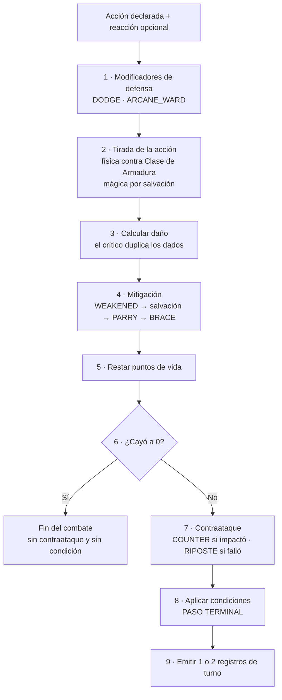
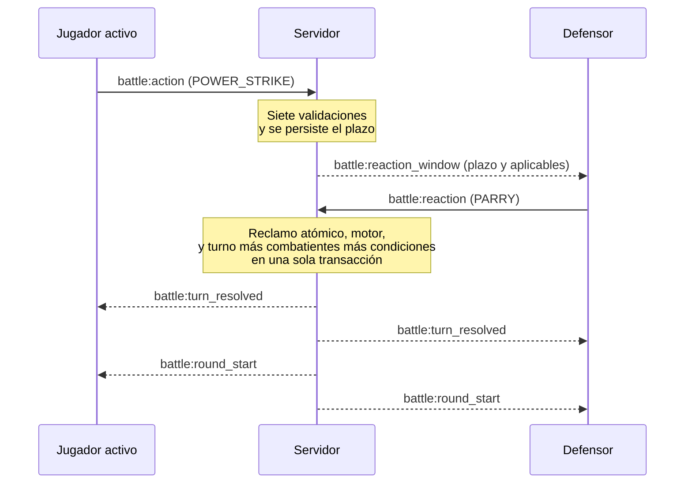
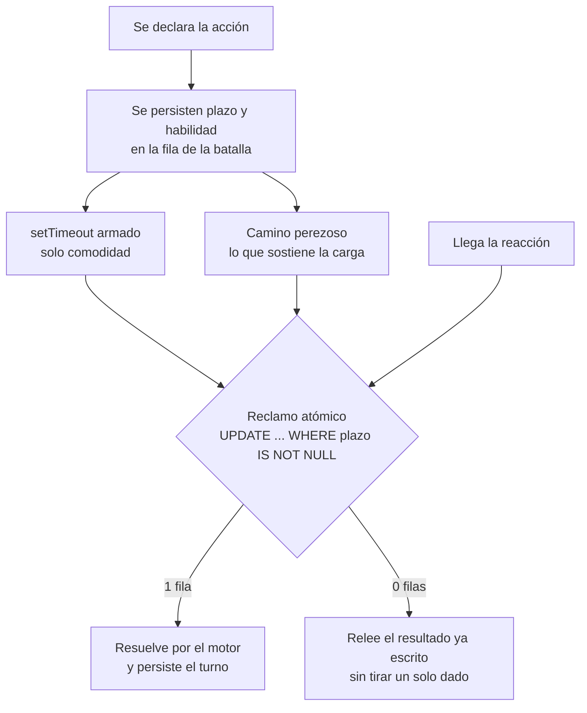

# Build Arena API

API de duelos por turnos entre builds, con el combate resuelto íntegramente en el servidor y transmitido en tiempo real por WebSocket.

Cuarto Proyecto Integrador — Integratec, agosto 2026.
Autor: **Agustín Tabarcache**

| | |
| --- | --- |
| Repositorio | https://github.com/Agustin742/build-arena-api |
| Deploy | https://build-arena-api.onrender.com |
| Documentación de la API | https://build-arena-api.onrender.com/reference |

---

## La idea

Los jugadores arman *builds* repartiendo un presupuesto fijo de puntos entre cuatro atributos y eligiendo un kit de habilidades. Después se desafían y pelean por turnos.

Todo lo que decide el resultado —las tiradas de dados, el cálculo de daño, los críticos, de quién es el turno y si una build es legal— **se resuelve en el servidor**. El cliente solo declara intención: nunca calcula, nunca valida, nunca decide.

Esa es la premisa del proyecto: *si el cliente puede calcularlo, el cliente puede mentirlo.*

---

## Estado

La API está desplegada, con el modelo de datos migrado, el catálogo de habilidades cargado, la autenticación funcionando de punta a punta, el motor de combate terminado y el combate en tiempo real andando sobre WebSocket: dos clientes pelean de punta a punta, y desconectar y reconectar a uno recupera la batalla en el punto exacto. Al terminar una batalla puntuable el rating de los dos jugadores se mueve, y el leaderboard lo refleja. Aceptar un desafío congela a los dos combatientes por completo —atributos y kit—, y ese kit congelado viaja al cliente en cada evento de estado.

| Fase | Estado |
| --- | --- |
| 0 — Fundación | Completa |
| 1 — Persistencia | Completa |
| 2 — Autenticación y seguridad | Completa |
| 3 — Motor de combate | Completa |
| 4 — Builds y catálogo | Completa |
| 5 — Social y desafíos | Completa |
| 6 — Tiempo real | Completa |
| 7 — Rating y cierre | Completa |
| 8 — Congelar el kit y exponerlo | Completa: deuda posterior a la entrega, no era un punto de la consigna |

---

## Tecnologías

| Rol | Herramienta |
| --- | --- |
| Framework | NestJS 11 + TypeScript |
| ORM y base de datos | Prisma 7 + PostgreSQL |
| Autenticación | `@nestjs/jwt` y `passport-jwt` (access + refresh) |
| Hasheo | `bcrypt` |
| Validación | `class-validator` y `class-transformer` |
| Seguridad | `helmet`, CORS, `@nestjs/throttler` |
| Tiempo real | WebSocket |
| Documentación | Scalar sobre OpenAPI |

---

## Instalación

Requiere Node 22 o superior, `pnpm` y una base PostgreSQL accesible.

```bash
pnpm install
cp .env.example .env
pnpm db:migrate
pnpm db:seed
pnpm start:dev
```

La API queda en `http://localhost:3000`.

`db:migrate` aplica las migraciones y genera el cliente de Prisma; `db:seed` carga el catálogo de habilidades. El seed es idempotente: correrlo de nuevo actualiza las filas existentes en lugar de duplicarlas.

> **Nunca uses la base de producción para desarrollar.** El proyecto usa dos bases distintas: un branch de desarrollo y uno de producción en Neon.

---

## Variables de entorno

Están declaradas sin valores en `.env.example`. `.env` nunca se commitea.

| Variable | Descripción |
| --- | --- |
| `PORT` | Puerto de escucha |
| `APP_VERSION` | Versión reportada por `/health` |
| `DATABASE_URL` | Cadena de conexión a PostgreSQL |
| `JWT_SECRET` | Secreto de firma del access token |
| `JWT_ACCESS_EXPIRES_IN` | Vigencia del access token |
| `JWT_REFRESH_SECRET` | Secreto de firma del refresh token |
| `JWT_REFRESH_EXPIRES_IN` | Vigencia del refresh token |
| `CORS_ORIGIN` | Orígenes permitidos, separados por coma. Si está vacía, CORS queda cerrado |
| `THROTTLE_TTL` | Ventana del limitador de peticiones, en milisegundos. Por defecto `60000` |
| `THROTTLE_LIMIT` | Peticiones permitidas por ventana. Por defecto `100` |

---

## Scripts

```bash
pnpm start:dev      # desarrollo con recarga
pnpm build          # genera el cliente de Prisma y compila a dist
pnpm start:prod     # ejecución de la compilación
pnpm lint           # eslint con corrección automática
pnpm test           # tests unitarios
pnpm test:e2e       # tests de extremo a extremo (requieren base de datos)

pnpm db:migrate     # crea y aplica una migración en desarrollo
pnpm db:deploy      # aplica migraciones pendientes en producción
pnpm db:generate    # regenera el cliente de Prisma
pnpm db:seed        # carga el catálogo de habilidades
pnpm db:studio      # explorador visual de la base
```

`db:migrate` solo va en desarrollo: puede resetear la base. En producción corre `db:deploy`, que aplica lo que ya existe y nunca genera migraciones nuevas.

---

## Endpoints

La referencia interactiva se sirve en [`/reference`](https://build-arena-api.onrender.com/reference), generada con Scalar a partir del documento OpenAPI que `@nestjs/swagger` arma con los decoradores de los DTOs y los controllers.

Todas las rutas exigen un access token salvo las marcadas con `@Public()`. En la referencia se prueban con el botón de autenticación, pegando el `accessToken` que devuelve `/auth/login`.

| Método | Ruta | Descripción | Estado |
| --- | --- | --- | --- |
| `GET` | `/health` | Estado, versión y tiempo de actividad | Disponible |
| `POST` | `/auth/register` | Crea un usuario | Disponible |
| `POST` | `/auth/login` | Devuelve access y refresh token | Disponible |
| `POST` | `/auth/refresh` | Rota el refresh token y emite un par nuevo | Disponible |
| `POST` | `/auth/logout` | Invalida el refresh token guardado | Disponible |
| `GET` | `/auth/me` | Perfil del usuario autenticado | Disponible |
| `GET` | `/skills` | Catálogo de habilidades | Disponible |
| `POST` | `/builds` | Crea una build validando presupuestos | Disponible |
| `GET` | `/builds` | Builds propias | Disponible |
| `GET` | `/builds/:id` | Una build propia | Disponible |
| `PATCH` | `/builds/:id` | Edita una build propia | Disponible |
| `DELETE` | `/builds/:id` | Borra una build propia | Disponible |
| `POST` | `/friendships` | Envía una solicitud de amistad | Disponible |
| `GET` | `/friendships` | Solicitudes y amistades, vistas desde quien consulta | Disponible |
| `PATCH` | `/friendships/:id/accept` | Acepta una solicitud recibida | Disponible |
| `DELETE` | `/friendships/:id` | Rechaza, cancela o elimina la amistad | Disponible |
| `POST` | `/battles` | Desafía a otro jugador con una build | Disponible |
| `GET` | `/battles` | Batallas propias | Disponible |
| `GET` | `/battles/:id` | Una batalla en la que participás | Disponible |
| `PATCH` | `/battles/:id/accept` | Acepta el desafío y congela a los dos combatientes, atributos y kit | Disponible |
| `PATCH` | `/battles/:id/reject` | Rechaza el desafío recibido | Disponible |
| `PATCH` | `/battles/:id/cancel` | Cancela el desafío enviado | Disponible |
| `GET` | `/leaderboard` | Ranking global por rating, de mayor a menor | Disponible |

El combate en sí no es REST: se juega sobre WebSocket, y el REST llega hasta que la batalla queda aceptada. Ver [Tiempo real](#tiempo-real).

---

## Motor de combate

El corazón del proyecto. Vive en [`src/combat/`](./src/combat) y es **TypeScript puro**:
no importa nada de `@nestjs`, no tiene `@Injectable()` y no expone ningún módulo del
framework. Se usa como una función: recibe estado, devuelve estado nuevo más los eventos
que ocurrieron, y nunca muta lo que recibe.

Con la fuente de aleatoriedad fija, las mismas entradas producen **siempre** la misma
salida. Un combate se puede testear, reproducir y auditar.

> Guía completa y camino de lectura archivo por archivo:
> [`docs/design/combat-engine.md`](./docs/design/combat-engine.md)

### Cómo se resuelve un turno

El motor resuelve la acción y la reacción **juntas**, en un orden fijo. El orden es el
motor: mover cualquier paso cambia el resultado de todos los combates.



El **paso 6** es explícito: un defensor que cae no contraataca. El **paso 8 es terminal**,
y de eso depende que una condición aplicada este turno no afecte este turno; hay un test
que se pone rojo si alguien inserta una tirada después.

### Resolución de un ataque

| | Físico | Mágico |
| --- | --- | --- |
| Tirada | `d20 + modificador(atributo)` contra la Clase de Armadura | El defensor tira `d20 + modificador(constitución)` |
| Objetivo | Clase de Armadura del rival | `8 + modificador(magia)` del atacante |
| Resultado | Binario: impacta o falla | Graduado: superarla reduce el daño a la mitad |
| Daño | `dados + modificador(atributo)` | `dados`, sin modificador |
| Crítico | 20 natural: duplica los **dados**, no el modificador | No existe |

Un **20 natural siempre impacta**, un **1 natural siempre falla**, y las dos cosas se
deciden antes de mirar la Clase de Armadura. Por eso `DODGE` no puede anular un crítico.

El atributo que resuelve es el que **desbloquea** la habilidad: `PRECISE_SHOT` exige
Destreza 13, así que tira y daña con Destreza.

**Ventaja y desventaja** tiran 2d20 y toman el alto o el bajo. No se acumulan, y se
cancelan mutuamente a una tirada limpia. Como el 20 natural es crítico, la ventaja sube
la tasa de críticos del 5% a ≈9.75%: es una consecuencia buscada y está documentada.

### Condiciones

Tres condiciones sobre tres ejes distintos, para que ninguna se pise con otra.

| Condición | Eje | Efecto |
| --- | --- | --- |
| `POISONED` | Puntería | Desventaja en tus ataques **y** −2 a la dificultad de salvación que imponés con magia |
| `STUNNED` | Tempo | Perdés tu acción **y** tu reacción esa ronda |
| `WEAKENED` | Daño | El daño que hacés se reduce a la mitad, redondeando abajo |

- Una condición aplicada a mitad de ronda **no afecta esa ronda**.
- Reaplicarla **refresca** la duración: no se apilan.
- El daño mágico aplica su condición **solo si la salvación falla**.
- El tick de duración corre solo para el combatiente que actúa: tres rondas son **tus**
  tres próximos turnos.

### Reacciones

El comportamiento vive en una tabla tipada del motor; los números vienen de la fila de
`Skill` en la base. Una reacción nueva del mismo tipo no necesita migración.

| Reacción | Responde a | Efecto |
| --- | --- | --- |
| `BRACE` | cualquiera | Reduce el daño en `modificador(constitución)`, reducción mínima 1 |
| `PARRY` | física | Reduce el daño a la mitad |
| `DODGE` | física | `+modificador(destreza)` a la Clase de Armadura contra ese ataque |
| `ARCANE_WARD` | mágica | `+modificador(magia)` a la tirada de salvación |
| `COUNTER` | cualquiera | Come el daño entero y devuelve `1d6 + modificador(fuerza)` si impactaron |
| `RIPOSTE` | física | Solo si **fallan**: devuelve `1d8 + modificador(destreza)` y aplica `WEAKENED` |

`DODGE` es a lo físico lo que `ARCANE_WARD` es a lo mágico: mejoran tu número de defensa
**antes** de la tirada. `BRACE` y `PARRY` reducen daño **después**. `COUNTER` y `RIPOSTE`
castigan, y ninguno tira ataque propio.

### Por qué la aleatoriedad está inyectada

```ts
export interface RandomSource {
  rollD20: () => number;
  rollDice: (notation: string) => number;
}
```

Con `Math.random()` incrustado en la resolución no se puede forzar un 20 natural ni
reproducir un combate que salió mal. Habría que tirar mil veces y confiar en la
estadística, que no es un test.

La interfaz tampoco sabe qué es la ventaja: eso se compone afuera, llamando `rollD20()`
dos veces. `SystemRandomSource` corre en producción y `SequenceRandomSource` reproduce
un guion fijo, que sirve tanto para los tests como para repetir un combate registrado.

### Garantías verificables

No son promesas, son comandos:

```bash
rg "@nestjs|@Injectable" src/combat/   # sin coincidencias: el motor es puro
rg "Math.floor" src/combat/            # solo en core/arithmetic.ts y core/random-source.ts
rg "Math.random" src/ -g '!*random-source*'   # sin coincidencias: nadie tira el dado por su cuenta
pnpm test                              # 459 tests, 45 suites
pnpm test:e2e                          # 47 tests, 9 suites, contra una base real
```

---

## Tiempo real

El combate se juega sobre WebSocket, con Socket.IO. El servidor resuelve **todo**: el cliente
no tira un solo dado. Lo único que recibe es un evento con lo que ya pasó.

Eso tiene una consecuencia que vale la pena nombrar: el front no necesita saber ninguna regla
del juego. Es una función pura sobre un registro de eventos, y se puede reemplazar entero sin
tocar una línea del servidor.

### Autenticación en el apretón de manos

Sin token válido no se entra a ninguna sala. La verificación corre como middleware del servidor
de Socket.IO, **antes** de `handleConnection`, así que una conexión sin credenciales se rechaza
antes de existir. No es una convención que alguien tiene que respetar: no hay un momento en el
que un socket anónimo esté adentro.

El cliente lo manda en el apretón de manos:

```ts
io(url, { auth: { token: accessToken } });
```

El socket **no hereda la autorización del REST**. Son dos superficies de ataque distintas, y un
mensaje que llega por WebSocket no pasó por ningún guard de HTTP.

### El contrato de eventos

Una sala por batalla, con los dos participantes y nadie más.

| Del cliente | Qué hace |
| --- | --- |
| `battle:join` | Entra a la sala y devuelve el estado completo desde la base |
| `battle:action` | Declara la acción del turno y abre la ventana de reacción |
| `battle:reaction` | Responde una ventana abierta, o la declina con `skillCode: null` |

| Del servidor | Cuándo |
| --- | --- |
| `battle:state` | Al entrar o reconectar: estado completo, kit congelado de cada combatiente, historial y ventana abierta si la hay |
| `battle:reaction_window` | Se abrió una ventana, con su plazo y las habilidades aplicables |
| `battle:turn_resolved` | El turno se resolvió, con las tiradas y el daño |
| `battle:round_start` | Arranca la ronda siguiente |
| `battle:opponent_left` | El rival se desconectó, con su plazo de abandono |
| `battle:ended` | La batalla terminó, por vida en cero o por abandono, con la variación de rating de los dos jugadores |
| `battle:error` | Un mensaje fue rechazado, con el motivo |

Una ronda completa, de punta a punta:



Los dos clientes reciben el **mismo** objeto: el resultado se calcula una vez y se transmite,
nunca se calcula dos veces.

### Las siete validaciones

Se aplican en **cada mensaje**, releídas desde la base. Estar dentro de una sala de Socket.IO
no es un permiso: entraste hace veinte minutos, y nada garantiza que la batalla siga viva ni que
siga siendo tu turno.

| | Pregunta | Qué frena |
| --- | --- | --- |
| **V1** | ¿Sos participante? | Enumeración: alguien probando identificadores |
| **V2** | ¿El estado admite este mensaje? | Jugar una batalla terminada o que no empezó |
| **V3** | ¿Es tu turno, o hay ventana para vos? | Jugar fuera de turno, declarar dos veces, reaccionar a tu propio ataque |
| **V4** | ¿La habilidad está en tu kit congelado? | Declarar algo que no tenés |
| **V5** | ¿Es del tipo correcto? | Usar una acción como reacción |
| **V6** | ¿Tenés la reacción disponible? | Reaccionar dos veces en una ronda |
| **V7** | ¿Ese casillero ya está escrito? | Reenvíos y escrituras duplicadas |

Tres cosas que no se ven en la tabla y son lo que hace que esto funcione:

**El orden es carga estructural.** Se devuelve la **primera** negativa y se corta. Por eso V1 va
primero: un extraño recibe `NOT_FOUND` con el mismo mensaje, byte por byte, que devuelve el REST
para una batalla inexistente. Si llegara a V2, el mensaje de estado equivocado le confirmaría que
la batalla existe. El orden **es** la política de privacidad.

**Se declaran una sola vez.** Viven en un array `CHECKS` y el handler no elige cuáles corren: a
qué mensajes aplica cada una es un dato, no un `if`. Un handler nuevo no puede saltearse una
validación por olvido. Y hay una guarda de completitud que se pone roja si alguien agrega o borra
una.

**Nada se guarda entre mensajes.** El contexto se arma por mensaje y se tira. Que la sala no
pueda sustituir a la validación no es una regla que alguien tiene que recordar: es que no existe
estado cacheado en el cual confiar.

### La ventana de reacción

El plazo vive **en una columna de la base**, y el `setTimeout` en memoria es solo comodidad.

No es purismo. El servicio gratuito de Render se apaga a los 15 minutos sin tráfico. Un timer que
vive únicamente en memoria muere con el proceso y deja ese turno colgado **para siempre**, sin
nadie que lo cierre. Con el plazo persistido, el próximo mensaje de cualquiera de los dos lo
resuelve, aunque hayan pasado tres días.



Los tres caminos llegan al **mismo** resolvedor. No hay una segunda forma de terminar un turno.

Y el reclamo atómico no es adorno: el índice único `(batalla, ronda, secuencia)` ordena las
**escrituras**, no el **trabajo**. Como resolver un turno consume aleatoriedad, dos competidores
tirarían los dados *antes* de que a alguno le falle la escritura, y saldrían dos resultados
distintos con uno descartado. El reclamo los serializa en el lock de la fila: el perdedor
matchea cero filas y se va sin tirar nada. El índice único queda abajo, como red para un
reintento posterior al commit.

Al vencer el plazo, **la reacción se conserva**. Y eso no está custodiado por tres condiciones
especiales: sale de una sola regla — se gastó solo si el registro de reacción tiene habilidad.
De ahí caen solos los tres casos: plazo vencido, declinación explícita y reacción ignorada.

### Reconexión

`battle:join` devuelve el estado completo **desde la base**: estado, ronda, jugador activo, los
dos bloques congelados con sus atributos y su kit, las condiciones activas, el historial de
turnos ordenado, y la ventana abierta con lo que le queda de plazo.

El kit va en `skillCodes`, y es de ahí que el cliente arma el menú de acciones. No de
`GET /builds/:id`: esa ruta lee la build **de ahora**, y la que está peleando es la que se
congeló al aceptar. Editar una build en medio de una batalla no cambia esa batalla.

Por eso el criterio de terminado de la fase es el que es: dos clientes pelean de punta a punta, y
desconectar y reconectar a uno recupera el combate en el punto exacto. El test que lo prueba usa
un socket **nuevo** y verifica que vuelva el mismo plazo con el tiempo restante recalculado. Con
el estado en memoria, ese valor no podría sobrevivir a un cliente distinto.

### Cierre

Dos caminos, los dos terminan en `FINISHED` con ganador y fecha:

- **Vida en cero.** El motor ya lo informa al resolver el turno.
- **Abandono.** Se registra la desconexión con un plazo de 2 minutos y se evalúa cuando el
  sobreviviente vuelve a hacer algo.

El cierre **no** es una fila más de la tabla de transiciones. Tiene su propio tipo de arista, y
el motivo es de seguridad: la columna `entitled` dice qué **jugador** puede mover la pieza, y
para una decisión que toma el servidor no existe ningún valor honesto. Poner "cualquiera de los
dos" habilitaría que un jugador que está perdiendo cierre su propia batalla.

Limitación aceptada y escrita: si los dos jugadores desaparecen para siempre, esa batalla queda
`IN_PROGRESS` hasta que alguno vuelva. El cierre se evalúa de forma perezosa y no hay ningún
barrido de fondo, que es coherente con una sola instancia que puede dormirse.

---

## Rating y leaderboard

Cuando una batalla puntuable termina, el rating de los dos jugadores se mueve. El cálculo
vive en [`src/rating/rules/elo.ts`](./src/rating/rules/elo.ts) y, como el motor de
combate, no importa nada de `@nestjs` ni de Prisma: una regla de rating que necesita una
base de datos para ejercitarse es una regla que nadie ejercita.

```
expectativa(jugador, rival) = 1 / (1 + 10^((rival - jugador) / 400))
puntos = max(1, redondear(32 * (1 - expectativa(ganador, perdedor))))
```

Todos arrancan en **1200**.

**Por qué K = 32.** Es el valor clásico, y es el lado correcto del intercambio para este
proyecto: más bajo, y un leaderboard construido con un puñado de duelos no separa a
nadie; más alto, y un d20 con suerte vale más que una semana de juego.

**Por qué suma cero estricta.** El número del perdedor es el del ganador **negado**, no
un segundo redondeo propio. Redondear cada lado por separado deja que un duelo acuñe o
queme un punto, y esa deriva no se ve en ninguna respuesta suelta: se ve meses después,
como un ranking que dejó de significar algo. Acá la cantidad de rating en la tabla se
conserva por construcción.

**Por qué el piso de un punto.** Pasados unos 800 puntos de diferencia la expectativa
redondea a 1, y la fórmula sin guarda le daría **cero** al ganador. Una victoria que no
cuesta nada está bien; una que no vale literalmente nada es un empate disfrazado.

**Las peleas entre amigos no puntúan.** Una batalla nace con `ranked = false` si al
crearse existe una amistad aceptada entre los dos participantes. Sin eso, dos amigos
escalan el ranking turnándose para perder. Es un agujero de reglas de negocio, y vive en
el servidor igual que el cálculo de daño.

Una batalla no puntuable **igual informa los dos ratings reales, con una variación de
cero**, en lugar de omitir el campo. Es la misma lección que dejó un campo ambiguo más
temprano en el proyecto: un cliente nunca tiene que leer una ausencia para entender qué
pasó.

**Dónde se escribe.** En los dos cierres posibles —derrota y abandono—, **dentro de la
misma transacción que cierra la batalla**. Nada vuelve a cerrar una batalla terminada,
así que un commit que perdiera la escritura del rating sería silencioso e irrecuperable.
Irse de un duelo puntuable es una derrota, no una salida de emergencia.

`battle:ended` lleva la variación completa, sin obligar a nadie a restar:

```json
{
  "battleId": "…",
  "winnerId": "…",
  "reason": "DEFEAT",
  "endedAt": "2026-09-02T13:40:00.000Z",
  "ranked": true,
  "ratingChanges": [
    { "userId": "…", "before": 1200, "change": 16, "after": 1216 },
    { "userId": "…", "before": 1200, "change": -16, "after": 1184 }
  ]
}
```

`GET /leaderboard` sirve el ranking global, de mayor a menor, con `limit` opcional (50 por
defecto, tope 100). Lee por las mismas tres columnas públicas que usan las amistades y las
batallas —id, nombre de usuario y rating—: un leaderboard que filtrara un email sería
exactamente la misma brecha que el endpoint de usuario evita con cuidado.

El desempate es por nombre de usuario. Sin esa segunda clave, PostgreSQL devuelve las
filas empatadas en el orden que quiera y dos jugadores con el mismo rating se
intercambian entre recargas. **Un ranking que se baraja al refrescar no es un ranking.**

---

## Seguridad

| Medida | Cómo está aplicada |
| --- | --- |
| Contraseñas | `bcrypt` con costo 12. Nunca se devuelven ni se registran |
| Autenticación | Access token de 15 minutos, refresh de 7 días con rotación |
| Refresh token | Se guarda solo su huella SHA-256; `logout` la borra |
| Autorización | `JwtAuthGuard` **global**: toda ruta exige token salvo las marcadas `@Public()` |
| Validación | `ValidationPipe` global con `whitelist`, `forbidNonWhitelisted` y `transform` |
| Cabeceras | `helmet`, con una CSP propia para la referencia de Scalar |
| CORS | Declarado por origen. Sin `CORS_ORIGIN`, ningún origen cruzado pasa |
| Fuerza bruta | `@nestjs/throttler` global, y 5 intentos por minuto en `register`, `login` y `refresh` |

El acceso a recursos ajenos responde `404` y no `403`, para no confirmar qué existe.

---

## Documentación del proyecto

| Documento | Contenido |
| --- | --- |
| [`docs/brief`](./docs/brief/proyecto-4-integrartec-2026.md) | Consigna original de la cátedra |
| [`docs/design/overview.md`](./docs/design/overview.md) | Diseño general, decisiones y modelo de datos |
| [`docs/design/architecture.md`](./docs/design/architecture.md) | Capas, responsabilidades y qué se comparte |
| [`docs/design/combat-engine.md`](./docs/design/combat-engine.md) | Motor de combate: guía de lectura, reglas y tubería |
| [`docs/design/implementation-plan.md`](./docs/design/implementation-plan.md) | Plan de fases y calendario |
| [`docs/design/git-workflow.md`](./docs/design/git-workflow.md) | Ramas, commits e integración |
| [`docs/frontend-guide.md`](./docs/frontend-guide.md) | Guía de integración para el cliente: endpoints, contrato de WebSocket y flujo de una partida |

Las capacidades se especifican con desarrollo guiado por especificación. Ocho especificaciones
vivas en [`openspec/specs/`](./openspec/specs): cuatro del motor de combate y cuatro del tiempo
real. Cada requisito está escrito con Dado/Cuando/Entonces y verificado contra la
implementación antes de archivar el cambio.

| Cambio archivado | Qué cubre |
| --- | --- |
| [`add-combat-engine`](./openspec/changes/archive/2026-08-31-add-combat-engine) | Fase 3. 21 requisitos, 53 escenarios |
| [`add-realtime-battle`](./openspec/changes/archive/2026-09-01-add-realtime-battle) | Fase 6. 36 requisitos, 52 escenarios |

---

## Deploy

La API corre en **Render** y la base en **Neon**, en dos servicios separados unidos por `DATABASE_URL`.

| Pieza | Proveedor | Por qué |
| --- | --- | --- |
| API | Render, plan gratuito | Despliegue automático desde `main` |
| PostgreSQL | Neon, plan gratuito | El PostgreSQL gratuito de Render expira a los 30 días y luego se borra |

```
URL          https://build-arena-api.onrender.com
Health       https://build-arena-api.onrender.com/health
```

Comandos configurados en el proveedor:

```bash
# Build Command
npm i -g pnpm@11.17.0 && pnpm install --frozen-lockfile && pnpm run build

# Start Command
pnpm db:deploy && pnpm db:seed && node dist/main
```

Las variables de entorno se cargan en el panel de Render, nunca en el repositorio.

> El plan gratuito apaga el servicio tras 15 minutos sin tráfico, y la primera petición después de eso tarda cerca de un minuto en despertar.
