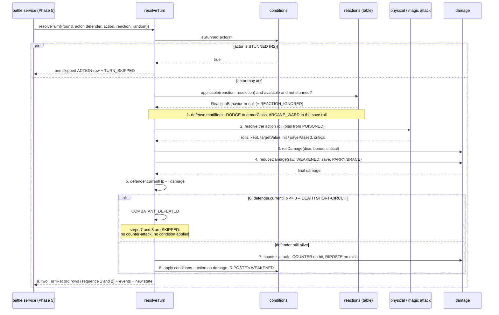

# Design: Combat Engine (Phase 3)

Change: `add-combat-engine`. Artifact store: hybrid — also persisted to Engram as
`sdd/add-combat-engine/design`.

Input treated as settled and not reopened here: the nine approved combat rules (Engram 227)
and the four delivery/boundary decisions (Engram 229). This document decides only *how* to
build them.

## Technical Approach

`src/combat/` is a folder of plain TypeScript modules — no `@nestjs` import, no
`@Injectable()`, no `combat.module.ts`, no Prisma import. Every module is a pure function or
a frozen constant. The single impurity, randomness, enters through the injected
`RandomSource`, so with a fixed source identical inputs produce byte-identical outputs.

Three properties drive every decision below:

1. **Framework-free** — `architecture.md` already designates `combat/` as the exception that
   exports no Nest module. Phase 5 imports functions, not providers.
2. **Schema-shaped without schema coupling** — domain types are structural subsets of
   `BattleCombatant`, `ActiveCondition` and `BattleTurn`, so Phase 5 persists them with a
   field copy and no mapping logic. No `prisma/schema.prisma` change, no migration.
3. **Additive in four slices** — each file belongs to exactly one PR slice, and no slice
   edits a file an earlier slice already shipped except `index.ts`.

## Domain Types

`src/combat/types.ts` holds the whole vocabulary and no logic.

```ts
export type ConditionType = 'POISONED' | 'STUNNED' | 'WEAKENED';
export type AttributeKey = 'STRENGTH' | 'MAGIC' | 'DEXTERITY' | 'CONSTITUTION';
export type SkillKind = 'ACTION' | 'REACTION';
export type ActionResolution = 'PHYSICAL' | 'MAGIC';
export type RollBias = 'NORMAL' | 'ADVANTAGE' | 'DISADVANTAGE';

/** = ActiveCondition minus `id` and `combatantId`. */
export type ActiveConditionState = {
  readonly type: ConditionType;
  readonly roundsRemaining: number;
};

/** = BattleCombatant minus `battleId`/`buildId`, plus its conditions. */
export type Combatant = {
  readonly id: string;
  readonly userId: string;
  readonly strength: number;
  readonly magic: number;
  readonly dexterity: number;
  readonly constitution: number;
  readonly armorClass: number;
  readonly maxHp: number;
  readonly currentHp: number;
  readonly initiative: number;
  readonly reactionAvailable: boolean;
  readonly conditions: readonly ActiveConditionState[];
};

/** Structural subset of `Skill`: a Prisma catalog row is directly assignable. */
export type CombatSkill = {
  readonly code: string;
  readonly type: SkillKind;
  readonly requiredAttribute: AttributeKey;
  readonly damageDice: string | null;
  readonly appliesCondition: ConditionType | null;
  readonly conditionRounds: number | null;
};

export type DeclaredAction = { readonly actorId: string; readonly skill: CombatSkill };
export type DeclaredReaction = { readonly actorId: string; readonly skill: CombatSkill };

/** = BattleTurn minus `id`, `battleId`, `createdAt` (all database-owned). */
export type TurnRecord = {
  readonly round: number;
  readonly sequence: number;
  readonly actorId: string;
  readonly kind: SkillKind;
  readonly skillCode: string | null;
  readonly attackRoll: number | null;
  readonly targetValue: number | null;
  readonly hit: boolean | null;
  readonly critical: boolean;
  readonly damage: number;
};

export type CombatEvent =
  | { readonly type: 'ROUND_STARTED'; readonly round: number; readonly actorId: string }
  | { readonly type: 'REACTION_RECHARGED'; readonly combatantId: string }
  | { readonly type: 'CONDITION_TICKED'; readonly combatantId: string; readonly condition: ConditionType; readonly roundsRemaining: number }
  | { readonly type: 'CONDITION_EXPIRED'; readonly combatantId: string; readonly condition: ConditionType }
  | { readonly type: 'CONDITION_APPLIED'; readonly combatantId: string; readonly condition: ConditionType; readonly rounds: number; readonly refreshed: boolean }
  | { readonly type: 'TURN_SKIPPED'; readonly combatantId: string; readonly reason: 'STUNNED' }
  | { readonly type: 'REACTION_IGNORED'; readonly combatantId: string; readonly skillCode: string; readonly reason: 'NOT_APPLICABLE' | 'UNAVAILABLE' | 'STUNNED' }
  | { readonly type: 'ATTACK_ROLLED'; readonly actorId: string; readonly rolls: readonly number[]; readonly kept: number; readonly targetValue: number; readonly hit: boolean; readonly critical: boolean }
  | { readonly type: 'SAVE_ROLLED'; readonly defenderId: string; readonly rolls: readonly number[]; readonly kept: number; readonly difficulty: number; readonly passed: boolean }
  | { readonly type: 'DAMAGE_MITIGATED'; readonly targetId: string; readonly skillCode: string; readonly before: number; readonly after: number }
  | { readonly type: 'DAMAGE_APPLIED'; readonly targetId: string; readonly amount: number; readonly currentHp: number }
  | { readonly type: 'COUNTER_ATTACKED'; readonly actorId: string; readonly skillCode: string; readonly damage: number }
  | { readonly type: 'COMBATANT_DEFEATED'; readonly combatantId: string };

export type TurnInput = {
  readonly round: number;
  readonly actor: Combatant;
  readonly defender: Combatant;
  readonly action: DeclaredAction;
  readonly reaction: DeclaredReaction | null;
  readonly random: RandomSource;
};

export type TurnResolution = {
  readonly actor: Combatant;
  readonly defender: Combatant;
  readonly turns: readonly TurnRecord[]; // 1 or 2 rows, ascending `sequence`
  readonly events: readonly CombatEvent[];
  readonly defeatedId: string | null;
};
```

`rolls` is plural because advantage and disadvantage draw two d20; `kept` is the single value
that goes into `BattleTurn.attackRoll`. `TurnRecord.actorId` carries `Combatant.id`
(the `BattleCombatant` id); `BattleTurn.actorId` has no foreign key, so Phase 5 may store
`userId` instead — `Combatant` carries both, and the swap is a field rename, not a mapping.

### Enums are mirrored, not imported

`ConditionType`, `AttributeKey` and `SkillKind` are re-declared as string-literal unions
instead of imported from `src/generated/prisma`. Importing the generated client would give
the engine a runtime dependency on Prisma, which `architecture.md` forbids for `combat/`. A
single guard spec uses a **type-only** import (fully erased at compile time) to assert mutual
assignability in both directions, so a future enum change fails the unit suite rather than
drifting silently.

## Architecture Decisions

| # | Decision | Alternatives rejected | Rationale |
|---|----------|-----------------------|-----------|
| D1 | `RandomSource` interface with `rollD20()` and `rollDice(notation)` | Seeded PRNG; bare `() => number` | Only shape where a test forces a natural 20 by writing `20`. A seed would need reverse engineering; a bare thunk cannot tell an attack roll from `2d6`. |
| D2 | Critical = doubled **notation** (`2d6` → `4d6`), one `rollDice` call | Call `rollDice('1d6')` per die; multiply the sum by 2 | `rollDice`'s contract is "sum of `count` independent dice", so `'4d6'` *is* four dice. The R15 assertion is the argument, and a scripted source still consumes four draws. Multiplying the sum would be a different, non-representable value. |
| D3 | All rule rounding routes through `arithmetic.ts` | `Math.floor` at each call site | One greppable invariant: `Math.floor` appears in exactly two files under `src/combat/` — `arithmetic.ts` (rules) and `random-source.ts` (die draw, not rule arithmetic). |
| D4 | Halvings first, flat `BRACE` subtraction last | Reaction mitigation before condition/save halving | `⌊⌊x/2⌋/2⌋ = ⌊x/4⌋`, so halvings provably commute and their relative order cannot matter. The flat subtraction does not commute, so it is pinned last — which also keeps R5's "minimum 1" a real floor instead of something a later halving turns into 0. |
| D5 | Reaction *behavior* in a typed table, reaction *numbers* in the database | All in the table; new `Skill` columns | See the split justification below. |
| D6 | R17 enforced by pipeline step order, not by a `pending` flag | A `pendingConditions` staging list on `Combatant` | Conditions are applied at step 8, which is terminal; nothing in the same turn rolls after it. A staging flag would have no column in `ActiveCondition` and would force a schema change for zero behavior. |
| D7 | `resolveTurn` is total — a non-applicable or unavailable reaction is ignored with an event | Throw | The engine has no error channel and no framework to translate one. Phase 5/6 already filters by applicability (§4.6); the engine degrades safely instead of crashing a battle. |
| D8 | `SequenceRandomSource` ships as engine surface, not a test-only helper | A helper file under `src/combat/testing/` | `tsconfig.build.json` excludes only `**/*spec.ts`, so a helper would ship in `dist` anyway. Deterministic replay of a logged battle is a real Phase 5/6 capability, so it belongs in the public surface honestly. |

## `RandomSource` and How a Test Fixes It

```ts
// src/combat/random-source.ts
export interface RandomSource {
  rollD20(): number;                    // 1..20
  rollDice(notation: string): number;   // sum of `count` independent d`faces`
}

export class SystemRandomSource implements RandomSource {
  rollD20(): number { return this.die(20); }

  rollDice(notation: string): number {
    const { count, faces } = parseNotation(notation);
    let total = 0;
    for (let i = 0; i < count; i += 1) total += this.die(faces);
    return total;
  }

  private die(faces: number): number { return Math.floor(Math.random() * faces) + 1; }
}

/** Replays a fixed script, one value per die drawn. Exhaustion throws. */
export class SequenceRandomSource implements RandomSource { /* ... */ }
```

Tests use the repo's existing convention — plain `jest.fn()`, no `TestingModule`:

```ts
const random = { rollD20: jest.fn(), rollDice: jest.fn() };

// a natural 20 -> critical, and an exact damage roll
random.rollD20.mockReturnValueOnce(20);
random.rollDice.mockReturnValueOnce(24);
const crit = resolvePhysicalAttack({ ...base, random });
expect(crit.critical).toBe(true);
expect(random.rollDice).toHaveBeenCalledWith('4d6'); // R15: twice the dice, not the sum doubled
expect(crit.rawDamage).toBe(24 + modifier(actor.strength));

// a natural 1 -> automatic miss, which is what opens the RIPOSTE trigger
random.rollD20.mockReturnValueOnce(1);
expect(resolvePhysicalAttack({ ...base, random }).hit).toBe(false);

// whole-pipeline determinism: nat 20 then 4d6 all sixes
const scripted = new SequenceRandomSource([20, 6, 6, 6, 6]);
expect(resolveTurn({ ...input, random: scripted })).toEqual(
  resolveTurn({ ...input, random: new SequenceRandomSource([20, 6, 6, 6, 6]) }),
);
```

## Advantage Without the Interface Knowing

```ts
// src/combat/d20.ts
export const resolveBias = (advantage: boolean, disadvantage: boolean): RollBias =>
  advantage === disadvantage ? 'NORMAL' : advantage ? 'ADVANTAGE' : 'DISADVANTAGE';

export const rollD20With = (
  random: RandomSource,
  bias: RollBias,
): { rolls: readonly number[]; kept: number } => {
  if (bias === 'NORMAL') {
    const only = random.rollD20();
    return { rolls: [only], kept: only };
  }
  const rolls = [random.rollD20(), random.rollD20()] as const;
  return { rolls, kept: bias === 'ADVANTAGE' ? Math.max(...rolls) : Math.min(...rolls) };
};
```

`resolveBias` is boolean equality, which is exactly §4.4's non-stacking and mutual
cancellation: two advantage sources are still one advantage, and advantage with disadvantage
collapses to a clean single roll. `RandomSource` never learns that advantage exists — it is
asked for a d20 once or twice, and the *caller* keeps the max or the min. The critical-rate
consequence recorded as decision D in Engram 229 (5% → ~9.75% under advantage) follows
directly and is left in place.

`POISONED` is the only bias source in the catalog today, and it applies to **attack rolls
only**. Saving throws and initiative are never biased, so a `POISONED` mage is mechanically
unaffected — magic has no attack roll. That is a strict consequence of R1 plus §4.3, not an
oversight, and it is documented rather than patched.

## Damage Arithmetic and the Rounding Order

```ts
// src/combat/arithmetic.ts — the only place a rule rounds
export const modifier = (score: number): number => Math.floor((score - 10) / 2);
export const halve = (value: number): number => Math.floor(value / 2);
export const clampDamage = (value: number): number => (value < 0 ? 0 : value);
```

```ts
// src/combat/damage.ts
export const reduceDamage = (raw: number, ctx: {
  readonly dealerWeakened: boolean;
  readonly savePassed: boolean;
  readonly mitigation: MitigationSpec | null;
  readonly reactor: Combatant;
}): number => {
  let value = clampDamage(raw);
  if (ctx.dealerWeakened) value = halve(value);                       // R3 WEAKENED
  if (ctx.savePassed) value = halve(value);                           // overview §4.3
  if (ctx.mitigation?.kind === 'HALVE') value = halve(value);         // R6 PARRY
  if (ctx.mitigation?.kind === 'FLAT' && value > 0) {                 // R5 BRACE
    value = Math.max(
      ctx.mitigation.minimum,
      value - modifier(attributeOf(ctx.reactor, ctx.mitigation.from)),
    );
  }
  return clampDamage(value);
};
```

**Stated order of operations, so it is not rediscovered during implementation:**
`WEAKENED` → save success → `PARRY` → `BRACE` → clamp at 0. The three halvings commute under
floor division, so their relative order is provably irrelevant; only the flat `BRACE`
subtraction is order-sensitive and it is fixed last. In practice at most two halvings ever
stack, because `PARRY` is physical-only and the save halving is magic-only, and because a
combatant declares exactly one reaction. `BRACE`'s minimum-1 floor is guarded by `value > 0`
so it can never *raise* damage that was already zero.

## The Nine-Step Resolution Pipeline



Step details that the ordering alone does not carry:

- **Step 1** reads the reaction's `defense` entry. `DODGE` adds `modifier(dexterity)` of the
  reactor to `armorClass` **for this attack only** — the stored `armorClass` is never mutated.
  `ARCANE_WARD` adds `modifier(magic)` to the defender's save roll, not to the difficulty.
- **Step 2** physical: `kept + modifier(resolvingAttribute)` versus the (possibly boosted)
  armor class; meeting it hits. A natural 20 hits and is critical; a natural 1 misses
  regardless of the total. Magic: `saveDifficulty = 8 + modifier(magic)` of the attacker
  against `d20 + modifier(constitution)` of the defender, with **no save critical** (R12).
- **Step 2, R14**: the resolving attribute is `skill.requiredAttribute`. `PRECISE_SHOT`
  therefore rolls and damages with dexterity. `resolution` is derived, not stored:
  `requiredAttribute === 'MAGIC' ? 'MAGIC' : 'PHYSICAL'`.
- **Step 6** is terminal for this turn. Steps 7 **and** 8 are skipped — a defeated combatant
  takes no counter-attack and receives no condition, so no `ActiveCondition` row is written
  for a battle that just ended.
- **Step 7** counter-attacks deal `dice + modifier(bonusFrom)` with **no attack roll of their
  own**; R9 and R10 give a formula and no target number. The counter is itself run through
  `reduceDamage` with `dealerWeakened` read from the reactor, so a `WEAKENED` counter is
  halved. A counter may kill the original actor; that is a legal end state.
- **Step 8** a condition lands only when the action actually dealt damage: on a hit for
  physical, and on a **failed save** for magic (R13). Re-applying an active condition
  overwrites `roundsRemaining` (R16, refresh) and emits `refreshed: true`.

## Where Reaction Behavior Lives, and Why the Split

```ts
// src/combat/reactions.ts
export type ReactionBehavior = {
  readonly answers: ActionResolution | 'ANY';
  readonly defense: { readonly bonusFrom: AttributeKey; readonly target: 'ARMOR_CLASS' | 'SAVE_ROLL' } | null;
  readonly mitigation: MitigationSpec | null;
  readonly counter: { readonly on: 'HIT' | 'MISS'; readonly bonusFrom: AttributeKey } | null;
};

export const REACTION_TABLE: Readonly<Record<string, ReactionBehavior>> = {
  BRACE:       { answers: 'ANY',      defense: null, mitigation: { kind: 'FLAT', from: 'CONSTITUTION', minimum: 1 }, counter: null },
  PARRY:       { answers: 'PHYSICAL', defense: null, mitigation: { kind: 'HALVE' }, counter: null },
  DODGE:       { answers: 'PHYSICAL', defense: { bonusFrom: 'DEXTERITY', target: 'ARMOR_CLASS' }, mitigation: null, counter: null },
  ARCANE_WARD: { answers: 'MAGIC',    defense: { bonusFrom: 'MAGIC', target: 'SAVE_ROLL' }, mitigation: null, counter: null },
  COUNTER:     { answers: 'ANY',      defense: null, mitigation: null, counter: { on: 'HIT',  bonusFrom: 'STRENGTH' } },
  RIPOSTE:     { answers: 'PHYSICAL', defense: null, mitigation: null, counter: { on: 'MISS', bonusFrom: 'DEXTERITY' } },
};

export const isApplicable = (behavior: ReactionBehavior, resolution: ActionResolution): boolean =>
  behavior.answers === 'ANY' || behavior.answers === resolution;
```

Every `bonusFrom` and `from` reads the **reactor's** attributes.

**Justification of the split.** The table carries only what the schema has no column for:
which action types a reaction answers, whether its bonus lands on armor class or on the save
roll, whether mitigation is a halving or a flat subtraction, and whether the counter triggers
on a hit or on a miss. Everything numeric that already has a column stays in the database and
is read from the declared `CombatSkill` row — `COUNTER` gets its `1d6` and `RIPOSTE` its
`1d8` from `Skill.damageDice`, and `RIPOSTE`'s `WEAKENED`/2 from `Skill.appliesCondition` and
`Skill.conditionRounds`, both already seeded. The line is drawn at *code versus data*: a new
reaction shape needs new engine code no matter where it is stored, so encoding it as schema
would buy a migration against an applied production database and no flexibility; but
re-tuning `1d6` to `1d8` is data, and forcing that through a code deploy would be a
regression against a catalog that is already seeded and already columned.

## Round Start as a Pure Function (Decision C)

```ts
// src/combat/round.ts
export const startRound = (input: { readonly round: number; readonly actor: Combatant }):
  { readonly actor: Combatant; readonly events: readonly CombatEvent[] } => { /* ... */ };
```

State in, new state plus events out. No mutation, no Prisma, no clock. Phase 5 calls it and
persists the returned combatant; the rules stay inside the engine so they remain testable in
milliseconds.

Internal order — **remove, then decrement, then recharge**:

1. Drop every condition already at `roundsRemaining === 0` (emit `CONDITION_EXPIRED`).
2. Decrement the survivors (emit `CONDITION_TICKED`).
3. Set `reactionAvailable = true` (emit `REACTION_RECHARGED`).

Remove-before-decrement is what makes the durations come out right. `STUNNED`/1 applied
mid-round enters at 1; at the bearer's next round start nothing is at 0, so it decrements to
0 and is **still present** — the bearer loses that action. It is removed at the following
round start. `POISONED`/3 is therefore active for exactly three of the bearer's rounds. A
decrement-then-remove order would expire `STUNNED` before it ever bit and make `MIND_SPIKE`
inert.

`reactionAvailable` mirrors the schema column and is recharged unconditionally; R2's reaction
loss is a separate gate read through `isStunned`, not a suppressed recharge. That keeps the
persisted column meaning exactly what it means in the database.

## The Skipped Turn (Decision B)

A `STUNNED` actor produces one `TurnRecord`, not an empty result:

```ts
{ round, sequence: 1, actorId: actor.id, kind: 'ACTION',
  skillCode: null, attackRoll: null, targetValue: null, hit: null,
  critical: false, damage: 0 }
```

plus a `TURN_SKIPPED` event. `BattleTurn.skillCode`, `attackRoll`, `targetValue` and `hit`
are already nullable — that nullability was required anyway for the reactions that roll
nothing (`BRACE`, `PARRY`, `DODGE`, `ARCANE_WARD`) — so **no schema change and no migration**.
The row is self-describing: `kind: 'ACTION'` with a null `skillCode` can only mean a lost
turn, because a real action always declares a skill. In a replay, "nothing happened" and
"nothing was recorded" stay distinguishable.

## File Layout

Every file is a plain module. No `@Injectable()`, no `combat.module.ts`, no `@nestjs` import,
and no `.ts` file outside `src/`.

| File | Slice | Responsibility (one line) |
|------|-------|---------------------------|
| `src/combat/types.ts` | 1 | The whole domain vocabulary — combatant, condition, skill, declarations, turn record, events — and no logic. |
| `src/combat/arithmetic.ts` | 1 | `modifier`, `halve`, `clampDamage`: the only place a game rule rounds. |
| `src/combat/arithmetic.spec.ts` | 1 | Rounding down at negative scores and odd values. |
| `src/combat/random-source.ts` | 1 | The `RandomSource` interface, `SystemRandomSource`, and `SequenceRandomSource` for deterministic replay. |
| `src/combat/random-source.spec.ts` | 1 | Notation parsing, per-die draw counts, sequence exhaustion. |
| `src/combat/derived-stats.ts` | 1 | `armorClass`, `maxHp`, `initiative` from attributes (§4.1). |
| `src/combat/derived-stats.spec.ts` | 1 | The three formulas, including negative modifiers. |
| `src/combat/d20.ts` | 1 | `resolveBias` cancellation and the one-or-two-roll d20 keeping high or low. |
| `src/combat/d20.spec.ts` | 1 | Advantage, disadvantage, mutual cancellation, non-stacking, call counts. |
| `src/combat/damage.ts` | 2 | Notation doubling for criticals, `rollDamage`, and the ordered `reduceDamage` chain. |
| `src/combat/damage.spec.ts` | 2 | R15 doubling, save halving, and the fixed reduction order. |
| `src/combat/physical-attack.ts` | 2 | `d20 + modifier(resolvingAttribute)` versus armor class, natural 20 and natural 1. |
| `src/combat/physical-attack.spec.ts` | 2 | Hit, miss, critical, R14 dexterity resolution, boosted armor class. |
| `src/combat/magic-attack.ts` | 2 | Save difficulty, the defender's save roll, `savePassed`, and no save critical (R12). |
| `src/combat/magic-attack.spec.ts` | 2 | Save passed and failed, R12 natural 20 and 1 doing nothing. |
| `src/combat/conditions.ts` | 3 | Reading `POISONED`/`STUNNED`/`WEAKENED` effects, applying with refresh, and the tick. |
| `src/combat/conditions.spec.ts` | 3 | R1, R2, R3, R16 refresh, expiry boundaries. |
| `src/combat/reactions.ts` | 3 | `REACTION_TABLE`, applicability, defense bonus, mitigation spec, counter trigger. |
| `src/combat/reactions.spec.ts` | 3 | Each reaction against its applicable and non-applicable action type. |
| `src/combat/round.ts` | 3 | `startRound`: the pure remove-decrement-recharge state transition (decision C). |
| `src/combat/round.spec.ts` | 3 | Duration arithmetic across rounds and the recharge. |
| `src/combat/turn.ts` | 4 | `resolveTurn`: the nine-step pipeline, the death short-circuit, and the emitted rows. |
| `src/combat/turn.spec.ts` | 4 | Step boundaries, the skipped turn, and cross-rule combinations. |
| `src/combat/index.ts` | 1, extended each slice | The public surface Phase 5 imports; the only file more than one slice touches. |

## PR Slices

Each slice compiles, tests and reverts alone; every file above appears in exactly one slice.

| Slice | Content | Independently landable because |
|-------|---------|-------------------------------|
| 1 | `types`, `arithmetic`, `random-source`, `derived-stats`, `d20` | Depends on nothing. `types.ts` declares the full vocabulary up front — including `MitigationSpec` and `ReactionBehavior` — so later slices add *producers*, never edit this file. |
| 2 | `damage`, `physical-attack`, `magic-attack`, plus the `docs/design/overview.md` §2.3 edit | `reduceDamage` ships with its final signature and `mitigation: null`; slice 3 only starts passing a non-null value. No slice-2 file is reopened. |
| 3 | `conditions`, `reactions`, `round` | Pure readers and constants over slice-1 types; each is unit-testable with a hand-built `Combatant`, with no pipeline in sight. |
| 4 | `turn` | Composition only. It imports slices 1–3 and adds no new rule. |

The layout was adjusted specifically to keep slice 2 landable: an earlier arrangement put the
whole damage-reduction chain in slice 3, which would have left slice 2 unable to express
"a successful save halves the damage" — a §4.3 rule that belongs with the magic attack. Fixing
the `reduceDamage` signature in slice 2 and populating its arguments in slice 3 removes that
coupling without reopening a shipped file.

## Data Flow

```
Phase 5  battle.service.ts
   |
   |  startRound({ round, actor })                        pure
   |      -> { actor, events }                            persist BattleCombatant + ActiveCondition
   |
   |  resolveTurn({ round, actor, defender, action, reaction, random })
   |      -> { actor, defender, turns[], events[], defeatedId }
   |
   +--> turns[]     ---> BattleTurn rows (field copy, add battleId)
   +--> combatants  ---> BattleCombatant.currentHp / reactionAvailable, ActiveCondition rows
   +--> events[]    ---> Phase 6 WebSocket payloads (never persisted)
```

| Engine type | Prisma model | Mapping |
|-------------|--------------|---------|
| `Combatant` | `BattleCombatant` + `ActiveCondition[]` | Field copy; engine omits `battleId`/`buildId`. |
| `ActiveConditionState` | `ActiveCondition` | Field copy; `@@unique([combatantId, type])` already forbids stacking, which is why R16 is a refresh. |
| `TurnRecord` | `BattleTurn` | Field copy plus `battleId`; `sequence` 1 = action, 2 = reaction. |
| `CombatSkill` | `Skill` | Structural subset — a catalog row is assignable as-is. |
| `CombatEvent` | none | In-memory only, for Phase 6. |

## Testing Strategy

Strict TDD: every branch gets a failing test first. Conventions copied from
`src/auth/auth.service.spec.ts` — co-located `*.spec.ts`, plain `jest.fn()`, direct
construction, no `@nestjs/testing` `TestingModule`.

| Layer | What to test | Approach |
|-------|--------------|----------|
| Unit | Each module in isolation: rounding, derived stats, bias cancellation, hit/miss/critical, save pass/fail, each condition, each reaction against both applicable and non-applicable action types | `jest.fn()` `RandomSource`, hand-built `Combatant` literals |
| Unit (composition) | The nine steps, the death short-circuit producing no counter-attack, the skipped turn row, `WEAKENED` + `PARRY` stacking, critical under advantage, `POISONED` on a reaction turn | `resolveTurn` with a scripted `SequenceRandomSource` |
| Determinism | Identical inputs and identical script produce deep-equal results | Two `SequenceRandomSource` instances over the same array, compared with `toEqual` |
| Contract | Engine enum unions stay assignable to and from the Prisma enums | One guard spec using a **type-only** import from `src/generated/prisma` |
| Purity | No `@nestjs` import, no `@Injectable()`, no `combat.module.ts` under `src/combat/` | Verified by `pnpm lint` and `pnpm build`; asserted in review |
| E2E | Nothing | The engine has no HTTP or WebSocket surface in this phase |

## Threat Matrix

N/A — no routing, shell, subprocess, VCS/PR automation, executable-file classification, or
process-integration boundary. The engine is in-memory arithmetic with no I/O, no network, no
filesystem, and no user-supplied string that reaches a command. The single parsed string is
dice notation, whose parser rejects anything that is not `NdM` and is unit-tested for that.

## Migration / Rollout

No migration required. No `prisma/schema.prisma` change and no new migration file. Nothing
imports `src/combat/` until Phase 5, and no Nest module registers it, so a defect here cannot
reach the running deployment. Rollback is `git revert` of the slice, or deleting the folder.

## Open Questions

None blocking. The following points were **left open by the ruleset and decided here**; each
is a design call, not an approved rule, and each is flagged for the oral defence:

- [x] A natural 20 hits and is critical; a natural 1 misses regardless of the total. Inferred
      from R12's wording ("a natural 20 or 1 on a **save** does nothing special"), which only
      reads as a carve-out if they do mean something on an attack roll. `DODGE` therefore
      cannot negate a critical, which keeps hitting monotonic in the die.
- [x] The round-start tick is scoped to the **acting** combatant only. §4.6 states the owner
      for the reaction recharge and leaves it unstated for the tick; scoping both to the actor
      makes "`POISONED` 3 rounds" mean "your next three turns", which is how a player reads it.
- [x] Counter-attacks (`COUNTER`, `RIPOSTE`) make **no attack roll**; R9 and R10 give a damage
      formula and no target number, so they land automatically.
- [x] The death short-circuit skips step 8 as well as step 7 — no condition is applied to a
      defeated combatant.
- [x] A condition lands only when the action dealt damage: hit for physical, failed save for
      magic (R13 states the magic half explicitly).
- [x] Prisma enums are mirrored as string-literal unions, guarded by one type-only
      assignability spec.
- [x] Critical is expressed as notation doubling with one `rollDice` call (D2).
- [x] Halvings run before the flat `BRACE` subtraction (D4).
- [x] `POISONED` has no effect on a magic attacker, because magic makes no attack roll.
      Documented consequence, deliberately not patched.
- [x] A declared reaction that is not applicable, not available, or suppressed by `STUNNED` is
      ignored with a `REACTION_IGNORED` event rather than raising an error (D7).

Deliberate deviation from the 800-word design budget: this document carries the concrete
TypeScript shapes, the reaction table and the sequence diagram that the phase brief and
`openspec/config.yaml` `rules.design` both require.
