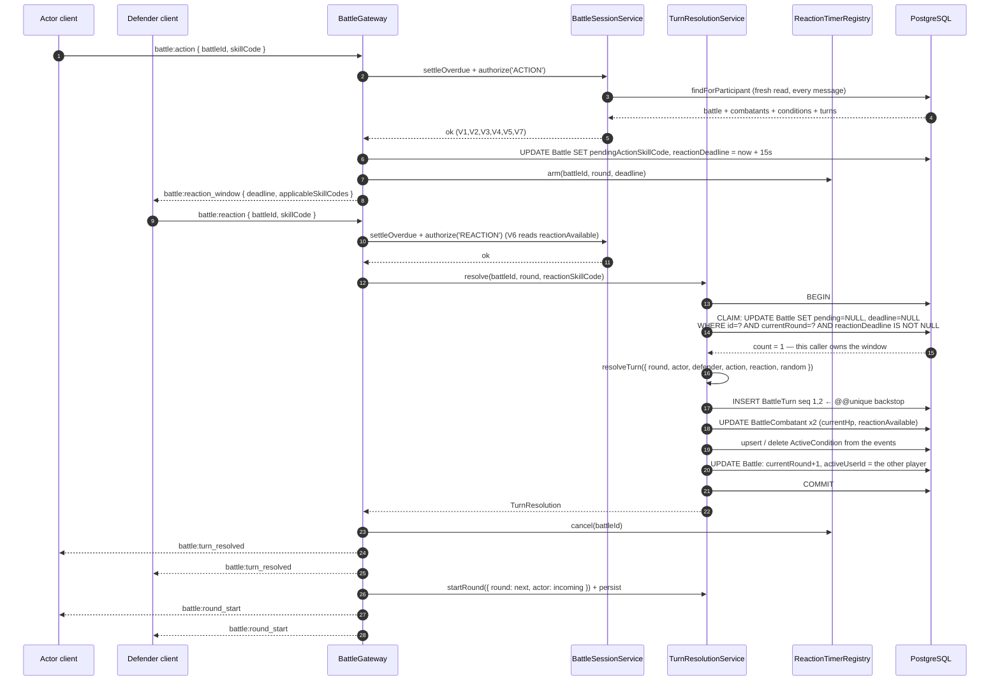
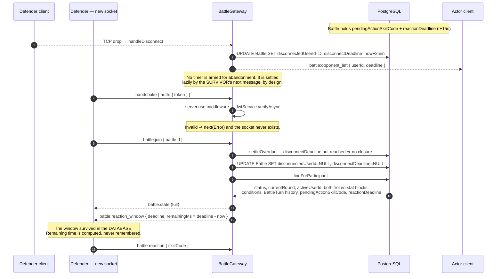

# Design: Real-time Battle (Phase 6)

Change: `add-realtime-battle`. Artifact store: hybrid — also persisted to Engram as
`sdd/add-realtime-battle/design`.

Settled upstream and **not reopened here**: the 15-second reaction window; expiry
**preserves** the reaction; the 2-minute abandonment deadline; full scope including the
in-memory timer; and the binding constraint that the **DB-persisted deadline is the
load-bearing mechanism** while the in-memory `setTimeout` is a comfort layer guarded by
idempotency. This document decides only *how*.

The two questions the proposal carried forward are answered first, because everything else
depends on them.

---

## D1 — Schema shape for transient real-time state

**Decision: four nullable columns directly on `Battle`. No `BattlePendingTurn` table.**

| Option | Tradeoff | Verdict |
|---|---|---|
| Nullable columns on `Battle` | Widens a row with fields that are non-null only while a window is open | **Chosen** |
| 1:1 `BattlePendingTurn` table | Keeps `Battle` narrow; costs a join on the hottest read and a second write in every resolution transaction | Rejected |

**Rationale.**

1. **The project's own rule.** `docs/design/architecture.md` § *Cuándo abstraer*: no abstraction before
   **three real cases**. There is exactly one case of transient window state. A side table is
   the premature abstraction that section exists to forbid.
2. **`Battle` is already a lifecycle row with phase-scoped nullable columns.** `winnerId`,
   `activeUserId`, `startedAt`, `endedAt` and `challengerBuildId` are all non-null only during
   part of a battle's life. Four more is consistent with the model's established shape, not a
   new smell. A side table would make the *new* state the odd one out.
3. **The lazy path reads the deadline on every single message.** With columns, the existing
   participant-scoped `findFirst` on `Battle` already carries them at zero extra cost. A 1:1
   table forces an `include` on the hottest read in the phase.
4. **Atomicity.** The window must be cleared in the *same* statement set that writes the
   `BattleTurn` rows and advances `currentRound`/`activeUserId` — all of which live on
   `Battle`. A side table adds a delete to that transaction and buys nothing.
5. **Rollback fidelity.** The proposal's rollback plan requires the migration to be *additive
   and nullable only*. Four `ADD COLUMN` statements roll back to four inert, unread columns.
   A dropped table would also need its Prisma relation field removed from `Battle`, so the
   revert touches a second model.

### Exact Prisma text

Added to `model Battle`, immediately after `endedAt`:

```prisma
  // --- Phase 6, transient real-time state. Every field is nullable and is
  // cleared in the same transaction that ends the situation it describes.
  // Invariant, held by the single writer in TurnResolutionService:
  //   reactionDeadline IS NOT NULL  <=>  pendingActionSkillCode IS NOT NULL
  // The actor of the pending action is `activeUserId`, which is not advanced
  // until the window resolves, so no second actor column is needed.
  pendingActionSkillCode String?
  reactionDeadline       DateTime?
  disconnectedUserId     String?
  disconnectDeadline     DateTime?
```

**`disconnectedUserId` deliberately carries no `User` relation.** A relation would add a
foreign key plus a fourth back-relation field on `User`, making the migration touch a second
model. The value is always `challengerId` or `opponentId`, both already foreign-key
constrained, so the FK would guard nothing that is not already guarded.

**No `CHECK` constraint** is added for the stated invariant. A check narrows the table and
would make the migration something other than purely additive; the invariant has exactly one
writer and is asserted in that writer's unit tests instead.

### Migration shape

The entire migration, one table, no data statement:

```sql
ALTER TABLE "Battle" ADD COLUMN "pendingActionSkillCode" TEXT;
ALTER TABLE "Battle" ADD COLUMN "reactionDeadline"       TIMESTAMP(3);
ALTER TABLE "Battle" ADD COLUMN "disconnectedUserId"     TEXT;
ALTER TABLE "Battle" ADD COLUMN "disconnectDeadline"     TIMESTAMP(3);
```

No `NOT NULL`, no `DEFAULT`, no backfill, no index, no constraint, no column dropped, no type
narrowed. Every existing row stays valid. Rollback is four `DROP COLUMN`s, and until then the
columns sit inert because no REST path reads them.

---

## D2 — Representing `IN_PROGRESS -> FINISHED`

**Decision: one module, two explicitly labeled kinds of edge.** `battle-transitions.ts` gains a
`BATTLE_CLOSURE` constant and a `closeBattle()` function beside the existing
`BATTLE_TRANSITIONS` / `applyTransition`. It does **not** gain a `FINISH` row inside
`BATTLE_TRANSITIONS`.

| Option | Tradeoff | Verdict |
|---|---|---|
| `FINISH` row in `BATTLE_TRANSITIONS` | One table, one function — but `entitled` must be filled with a value that is false | Rejected |
| Bare `prisma.battle.update({ status: FINISHED })` in the gateway | The hand-rolled second path the proposal names as the risk | Rejected |
| `BATTLE_CLOSURE` + `closeBattle()` in the same module | Two edge kinds to learn; single-sources the machine at the module level | **Chosen** |

**Rationale — why a `FINISH` row is not merely awkward but unsafe.** Every `TransitionRule`
carries `entitled`, and the file's own comment states its purpose: *"a machine with only the
first column lets the challenger accept their own challenge."* A `FINISH` row needs a value
there and every honest candidate is wrong. `'EITHER'` would make
`applyTransition('FINISH', battle, actorId)` **return `allowed: true` for any participant who
simply asks to end a battle they are losing**. That is not a cosmetic type mismatch; it is a
live privilege escalation the moment any future REST route calls `applyTransition`
generically. Making `entitled` optional would weaken the type for the four rows where it is
the load-bearing check.

**Rationale — why this is not the hand-rolled path the proposal warns about.** The risk named
in the proposal is *two divergent state machines*, and the level that risk lives at is the
**module**, not the constant. `closeBattle` still validates `from === IN_PROGRESS`, still
returns a typed refusal instead of silently flipping a status, and ships through the same
`src/battle/rules/index.ts` barrel that REST already imports. A future REST force-close
endpoint calls the identical function. REST and WS read one file; neither owns a private
machine.

```ts
// src/battle/rules/battle-transitions.ts — added beside BATTLE_TRANSITIONS

/** Why the server closed a battle. Not a player move, so there is no `entitled` side. */
export type ClosureReason = 'DEFEAT' | 'ABANDONMENT';

/**
 * The one SERVER-DECIDED edge of the machine. It lives in this file because there
 * must be exactly one place that answers "what statuses can a battle reach". It is a
 * SEPARATE constant because `entitled` answers "which player may make this move", and
 * here nobody moves: the engine reported a defeat, or a deadline passed.
 */
export const BATTLE_CLOSURE = {
  from: BattleStatus.IN_PROGRESS,
  to: BattleStatus.FINISHED,
} as const;

export type ClosureOutcome =
  | { allowed: true; to: BattleStatus; winnerId: string; reason: ClosureReason }
  | { allowed: false; reason: 'WRONG_STATUS'; message: string };

export function closeBattle(
  battle: StoredBattle,
  winnerId: string,
  reason: ClosureReason,
): ClosureOutcome;
```

**Structural guard against a third path.** One unit test asserts that the union of
`BATTLE_TRANSITIONS[*].to` and `BATTLE_CLOSURE.to` covers every `BattleStatus` except
`PENDING`, so a status made reachable by some future direct `update` fails the suite rather
than drifting.

---

## Technical Approach

The gateway is a **thin transport layer**. It subscribes, authorizes, delegates, and emits. It
holds no combat rule and no state machine of its own: `applyTransition`, `closeBattle`,
`resolveTurn` and `startRound` are consumed exactly as written.

Three properties drive everything below.

1. **The database is the only authority.** Socket.IO room membership is never authorization —
   `docs/design/overview.md` §8.2 draws the line explicitly (*"un `AuthGuard` sin reglas de
   propiedad es una API abierta con pasos extra"*), and all authorization in this project is by
   resource ownership and battle participation, never by role. Every message re-reads the battle
   fresh and re-runs the checks.
2. **One resolver, three callers.** The reaction handler, the expiry timer and the lazy check
   all call the *same* `TurnResolutionService.resolve()`. Neither the timer nor the lazy path
   is ever the sole resolver, because there is only one.
3. **Idempotency is structural, not stated.** An atomic claim inside the transaction serializes
   the racers, and `@@unique([battleId, round, sequence])` is the hard backstop underneath it.
   A duplicate resolution is a no-op that re-emits, never an error.

### Module and file layout

`src/ws/` is already the planned home in `docs/design/architecture.md` § *Estructura de
carpetas*, so this phase fills a
slot rather than inventing one.

| File | Responsibility (one line) |
|---|---|
| `src/ws/ws.module.ts` | Wiring: imports `BattleModule`, `PrismaModule`, `JwtModule.register({})`; provides the gateway, the two services, the timer registry and `randomSourceProvider`. |
| `src/ws/battle.gateway.ts` | Transport only: `afterInit` installs the auth middleware, three `@SubscribeMessage` handlers, `handleConnection`/`handleDisconnect`, room join, event emission. No rule. |
| `src/ws/ws-auth.middleware.ts` | The Socket.IO `server.use()` factory: verify `handshake.auth.token`, set `socket.data.user`, or `next(new Error(...))`. |
| `src/ws/battle-session.service.ts` | `settleOverdue()`, the participant-scoped load, the authorization pipeline entry point, and `battle:state` assembly. |
| `src/ws/turn-resolution.service.ts` | The single transactional resolver: claim, engine call, persistence, idempotent no-op, closure. |
| `src/ws/reaction-timer.registry.ts` | The in-memory comfort layer. `arm`/`cancel`/`onModuleDestroy`. Calls the resolver, owns no logic. |
| `src/ws/battle-events.ts` | The typed event contract: names, payload types, error codes. No logic. |
| `src/ws/rules/message-checks.ts` | The seven validations of `docs/design/overview.md` §7, pure, declared once. |

`WsModule` cannot import `AuthModule` for token verification: `AuthModule` exports only
`TokenService`, never `JwtService`. It registers `JwtModule.register({})` itself and calls
`requireEnv('JWT_SECRET')` at verification time — the codebase's existing *"two independent
verifiers, one env var"* pattern, already used by `TokenService` and `JwtStrategy`.
`randomSourceProvider` is likewise re-registered here, because `BattleModule` provides it
without exporting it and `PrismaModule` is deliberately non-global
(`docs/design/architecture.md` § *Estructura de carpetas*).

### What `battle.service.ts` exposes

The gateway must not duplicate the participant scoping, but it also must not inherit REST's
`NotFoundException`. Two changes:

- **`src/battle/rules/participant-clause.ts`** — the module-level `participantClause` helper
  moves out of `battle.service.ts` into `rules/` and is exported through the barrel. It is the
  pure *"who may see this battle"* predicate, and it belongs with the other rules. This is the
  thing that must never diverge between REST and WS.
- **`BattleService.findForParticipant(id, userId): Promise<BattleSessionRow | null>`** — new,
  public, and **non-throwing**. It returns the full session row (battle + both combatants with
  their `conditions` + `turns` ordered by `round, sequence` + `challenger`/`opponent` through
  `PLAYER_COLUMNS`). Returning `null` instead of throwing is the point: REST keeps mapping
  absence to 404, and the gateway maps it to `battle:error` with the same generic message,
  without an HTTP exception ever entering the socket layer.

The existing private `involvingCaller` is kept for REST's light reads and refactored to use the
extracted `participantClause`. The heavier `include` is legitimately different; only the
authorization clause is single-sourced. `BattleModule` already exports `BattleService`, so
`WsModule` needs no new export.

---

## Handshake Authentication

**Confirmed as the exploration recommends**, with two concrete additions.

Socket.IO **server-level middleware** installed in `afterInit`, calling
`JwtService.verifyAsync<AccessTokenPayload>(token, { secret: requireEnv('JWT_SECRET') })`,
reading the token from `handshake.auth.token`, and attaching
`{ id: payload.sub, username: payload.username }` to `socket.data.user`.

**Why middleware rather than `handleConnection`.** `docs/design/overview.md` §7 states the
requirement in bold — *"Una conexión sin token válido se rechaza antes de unirse a ninguna
sala"* — and §8.1 repeats it as a domain-specific measure. Middleware runs *before*
`handleConnection`, so a tokenless connection is refused by the transport itself. "No valid
token, no room, ever" becomes structural — there is no code path where an unauthenticated socket exists and a future
handler could forget to check it. That is a stronger property than a first-line guard inside a
lifecycle hook, and it is the whole reason to prefer it.

**Why not the Passport strategy.** `ExtractJwt.fromAuthHeaderAsBearerToken()` expects an
Express-shaped `req`; bridging a `Socket` into that shape is brittle for a `validate()` that is
two lines. Rejected, as the exploration concluded.

Two additions this design pins down:

- **`handshake.auth.token` is the only accepted location.** Not the `Authorization` header, not
  a query parameter. One location is one thing to audit, and `io(url, { auth: { token } })` is
  the standard socket.io v4 convention.
- **`AccessTokenPayload` and `AuthenticatedUser` are imported type-only** from `src/auth/`, so
  the socket identity is the *same shape* as REST's without duplicating the mapping and without
  `src/ws` gaining a runtime dependency on `AuthModule`.

---

## The Seven Validations, Applied Uniformly

The requirement is that no handler can forget a check or drift from another handler's copy. A
NestJS guard cannot carry this: V4–V7 need the declared skill, the open window and the persisted
turn slot, so splitting the seven across a guard and a handler *reintroduces* the copy-paste it
was meant to prevent.

Instead: **one ordered array, one loop, one entry point.** Handlers never name a check.

```ts
// src/ws/rules/message-checks.ts
export type MessageIntent = 'JOIN' | 'ACTION' | 'REACTION';

type Check = {
  readonly id: 'V1' | 'V2' | 'V3' | 'V4' | 'V5' | 'V6' | 'V7';
  readonly appliesTo: readonly MessageIntent[];
  readonly run: (ctx: SessionContext) => WsDenial | null;
};

/**
 * The seven validations of docs/design/overview.md §7, in order, declared exactly once.
 * `appliesTo` is data, not control flow: a handler cannot select a check, and
 * adding an intent cannot silently skip one.
 */
const CHECKS: readonly Check[] = [
  { id: 'V1', appliesTo: ['JOIN', 'ACTION', 'REACTION'], run: /* participant */ },
  { id: 'V2', appliesTo: ['JOIN', 'ACTION', 'REACTION'], run: /* status */ },
  { id: 'V3', appliesTo: ['ACTION', 'REACTION'],         run: /* turn or open window */ },
  { id: 'V4', appliesTo: ['ACTION', 'REACTION'],         run: /* skill in this build's kit */ },
  { id: 'V5', appliesTo: ['ACTION', 'REACTION'],         run: /* ACTION vs REACTION moment */ },
  { id: 'V6', appliesTo: ['REACTION'],                   run: /* reactionAvailable */ },
  { id: 'V7', appliesTo: ['ACTION', 'REACTION'],         run: /* round/sequence slot free */ },
];

export const authorize = (intent: MessageIntent, ctx: SessionContext): WsDenial | null => {
  for (const check of CHECKS) {
    if (!check.appliesTo.includes(intent)) continue;
    const denial = check.run(ctx);
    if (denial) return denial;
  }
  return null;
};
```

Three properties this buys:

- **V1 and V2 are universal**, including `battle:join`. V2 accepts `ACCEPTED` *or*
  `IN_PROGRESS` for the `JOIN` intent only, because joining is what fires
  `applyTransition('START', ...)`; every other intent requires `IN_PROGRESS`.
- **`ctx` is always freshly read**, never carried across messages, so room membership is
  structurally incapable of standing in for authorization.
- **A completeness unit test** asserts `CHECKS.map(c => c.id)` equals `['V1'..'V7']` in order,
  so a deleted or reordered check fails the suite rather than quietly weakening the surface.

`settleOverdue()` runs **before** the loop, so the state V2/V3/V7 read is already up to date.

### Denial mapping

`NOT_A_PARTICIPANT` returns the **same generic message REST uses** (`Battle not found`) and
refuses the room join without confirming the battle exists — the information-hiding property of
the REST 404/403 split, re-expressed as message content because Socket.IO has no status codes.
Everything else may be specific: the caller already knows they are a participant.

| Code | Raised by |
|---|---|
| `UNAUTHORIZED` | handshake middleware (connection refused, no event) |
| `NOT_FOUND` | V1 — generic, identical to REST |
| `WRONG_STATUS` | V2 |
| `NOT_YOUR_TURN` | V3, actor path |
| `ALREADY_DECLARED` | V3, second `battle:action` while the actor's own window is open |
| `NO_OPEN_WINDOW` | V3, `battle:reaction` with no window (covers the double-reaction case) |
| `SKILL_NOT_IN_KIT` | V4 |
| `WRONG_SKILL_TYPE` | V5 |
| `REACTION_UNAVAILABLE` | V6 |
| `TURN_ALREADY_RECORDED` | V7 |

`ALREADY_DECLARED` and `NO_OPEN_WINDOW` are distinct codes precisely because the proposal names
them as separate scenarios; neither collapses into `NOT_YOUR_TURN`.

---

## Event Contract

### Client → server

| Event | Payload |
|---|---|
| `battle:join` | `{ battleId: string }` |
| `battle:action` | `{ battleId: string; skillCode: string }` |
| `battle:reaction` | `{ battleId: string; skillCode: string \| null }` |

`skillCode: null` on a reaction is an explicit decline: it resolves the window immediately and
**preserves** the reaction, exactly as expiry does.

### Server → client

| Event | Payload |
|---|---|
| `battle:state` | `{ battleId, status, currentRound, activeUserId, combatants: CombatantView[], turns: TurnView[], openWindow: WindowView \| null, opponentLeft: LeftView \| null }` |
| `battle:round_start` | `{ battleId, round, activeUserId, events: CombatEvent[] }` |
| `battle:reaction_window` | `{ battleId, round, actorUserId, actionSkillCode, deadline: string, remainingMs: number, applicableSkillCodes: string[] }` |
| `battle:turn_resolved` | `{ battleId, round, turns: TurnView[], events: CombatEvent[], combatants: CombatantView[], defeatedId: string \| null }` |
| `battle:ended` | `{ battleId, winnerId, reason: 'DEFEAT' \| 'ABANDONMENT', endedAt: string }` |
| `battle:opponent_left` | `{ battleId, userId, deadline: string }` |
| `battle:error` | `{ code: WsErrorCode, message: string, event?: string }` |

```ts
type CombatantView = {
  userId: string; combatantId: string;
  strength: number; magic: number; dexterity: number; constitution: number;
  armorClass: number; maxHp: number; currentHp: number;
  initiative: number; reactionAvailable: boolean;
  conditions: { type: ConditionType; roundsRemaining: number }[];
};
type TurnView = { round: number; sequence: number; actorId: string; kind: SkillType;
                  skillCode: string | null; attackRoll: number | null;
                  targetValue: number | null; hit: boolean | null;
                  critical: boolean; damage: number };
type WindowView = { round: number; actorUserId: string; actionSkillCode: string;
                    deadline: string; remainingMs: number; applicableSkillCodes: string[] };
type LeftView   = { userId: string; deadline: string };
```

Both stat blocks are sent to both players — already authorized by the authorization matrix in
`docs/design/overview.md` §8.2 (*"Ver la del rival: solo si es combatiente de una batalla que
compartís"*).
`battle:ended` carries **no rating delta field at all** until Phase 7; the field is absent, not
null. `applicableSkillCodes` is computed from the defender's kit through `REACTION_TABLE` and
`isApplicable`, both already exported from `src/combat`.

**No server-pushed countdown ticks.** `deadline` plus `remainingMs` is everything a client needs
to run its own countdown, and it stays correct across a reconnect because it is derived from the
persisted column, not from a server-side interval.

---

## Sequence Diagrams

### 1. A full turn with a reaction declared



### 2. The window expires — both paths converge, reaction preserved

```mermaid
sequenceDiagram
    autonumber
    participant R as ReactionTimerRegistry<br/>(comfort layer)
    participant M as Any next message<br/>(lazy — LOAD-BEARING)
    participant T as TurnResolutionService.resolve
    participant DB as PostgreSQL
    participant C as Both clients

    Note over R,M: Window open, reactionDeadline now in the past.

    par Timer path — dies with the process
        R->>T: setTimeout fires at the deadline
    and Lazy path — survives restart and free-tier sleep
        M->>T: settleOverdue(), before that message's own checks
    end

    T->>DB: BEGIN + CLAIM UPDATE ... WHERE reactionDeadline IS NOT NULL
    Note over T,DB: Postgres serializes both UPDATEs on the row lock;<br/>the loser re-evaluates the WHERE and matches 0 rows.

    alt claim count = 1 — winner
        T->>T: resolveTurn({ ..., reaction: null })
        Note over T: reaction: null ⇒ no REACTION_IGNORED event,<br/>and reactionAvailable is never written ⇒ PRESERVED
        T->>DB: INSERT BattleTurn seq 1,2 + combatants + Battle
        T->>DB: COMMIT
        T-->>C: battle:turn_resolved (reaction skillCode: null)
    else claim count = 0 — loser, or a client retry after commit
        T->>DB: ROLLBACK, then re-read the persisted BattleTurn rows
        Note over T,DB: If the claim is ever bypassed, the INSERT raises<br/>P2002 on @@unique([battleId, round, sequence])<br/>and the SAME idempotent no-op runs.
        T-->>C: battle:turn_resolved — re-emitted from the DB, byte-identical
    end
```

### 3. Disconnect, then reconnect mid-window



---

## Transaction Boundaries

One interactive `prisma.$transaction(async (tx) => ...)` per resolution. The array form cannot
be used: the claim is a read-decide-write.

| # | Statement | Why it is at this position |
|---|---|---|
| 1 | **Claim**: `tx.battle.updateMany({ where: { id, currentRound, reactionDeadline: { not: null } }, data: { pendingActionSkillCode: null, reactionDeadline: null } })` | Exactly one caller gets `count === 1`. Under Postgres READ COMMITTED the second writer blocks on the row lock, then re-evaluates the `WHERE` after the first commits and matches zero rows. `count === 0` aborts with a sentinel. |
| 2 | Load both combatants + `conditions` via `tx` | Must be inside, so the engine never sees state the claim did not lock. |
| 3 | `resolveTurn(...)` — **pure, in-memory** | Microseconds of CPU inside the transaction. No I/O, so the row lock is held briefly. |
| 4 | `tx.battleTurn.createMany` for the 1–2 rows | **The hard backstop.** Runs before any other write so a `P2002` rolls the whole thing back with nothing partial persisted. |
| 5 | `tx.battleCombatant.update` ×2 — `currentHp`, `reactionAvailable` | — |
| 6 | `tx.activeCondition` upsert / delete, mirroring `CONDITION_APPLIED` / `CONDITION_TICKED` / `CONDITION_EXPIRED` | — |
| 7 | `tx.battle.update` — advance `currentRound` + `activeUserId`, **or** `closeBattle` fields | The window columns were already cleared by the claim. |

**`createMany` must not use `skipDuplicates: true`.** Skipping would silently persist a partial
turn. It must raise `P2002` and roll back.

```ts
const UNIQUE_VIOLATION = 'P2002';   // beside the existing FOREIGN_KEY_VIOLATION = 'P2003'
```

**Why the re-emit reads the database instead of re-running the engine.** `resolveTurn` consumes
randomness, so a second run would produce a *different* result. The idempotent no-op therefore
re-reads the persisted `BattleTurn` rows and combatant state and emits those. This is what makes
"exactly one pair of rows, and the same result re-emitted" literally true.

### Spending the reaction is the gateway's job

`resolveTurn` **never writes `reactionAvailable`** — it only reads it in `gateReaction`. Only
`startRound` sets it back to `true`. So the persistence step applies exactly one rule:

> Set the defender's `reactionAvailable = false` **iff** `turns[1].skillCode !== null`.

`reactionRow.skillCode` is non-null only when the reaction passed every gate and was actually
used. That single rule makes three required behaviors fall out with no special case: expiry
preserves the reaction, an explicit `null` decline preserves it, and a `REACTION_IGNORED`
reaction preserves it.

### Round advancement

`START` sets `currentRound = 1` and `activeUserId` to the higher `initiative` (ties break to the
challenger, deterministically). Each resolved turn increments `currentRound` and flips
`activeUserId`, then calls `startRound` for the **incoming actor only** — which is the engine's
Decision F, and is what makes "POISONED 3 rounds" mean the bearer's own next three turns.
Because every turn owns its own round number, `@@unique([battleId, round, sequence])` stays a
clean action/reaction pair.

---

## `RANDOM_SOURCE` Injection

`WsModule` lists `randomSourceProvider` in `providers` (it is provided but not exported by
`BattleModule`, and `PrismaModule` is deliberately non-global, so re-declaring is the
established convention). `TurnResolutionService` mirrors `BattleService` exactly:

```ts
constructor(
  private readonly prisma: PrismaService,
  @Inject(RANDOM_SOURCE) private readonly random: RandomSource,
) {}
```

A test scripts the dice by overriding the token, never by stubbing `Math.random`:

```ts
const scripted = new SequenceRandomSource([12, 9, 15, 4, 3, /* ... */]);
const moduleFixture = await Test.createTestingModule({ imports: [AppModule] })
  .overrideProvider(RANDOM_SOURCE)
  .useValue(scripted)
  .compile();
```

**Gotcha worth pinning:** overriding a string token replaces it wherever it is registered, so
the override also drives `freezeCombatant`'s initiative roll during REST `accept`. The script
must budget **two initiative d20s first**, before the first turn's attack roll. Getting this
wrong surfaces as `SequenceRandomSource` exhaustion, not as a wrong number.

---

## The In-Memory Timer

`ReactionTimerRegistry` is a `Map<battleId, NodeJS.Timeout>` — correct because
`docs/design/overview.md` §2.9 (*"No se usa Redis ni memoria del proceso… una sola
instancia"*) fixes this
at one instance; multi-instance is explicitly out of scope.

- `arm(battleId, deadline)` → `setTimeout(..., deadline - now)`, then **`.unref()`** so it never
  holds the process (or a Jest run) open.
- `cancel(battleId)` on every resolution.
- `onModuleDestroy()` clears every outstanding timer — required, or `pnpm test:e2e` reports open
  handles.
- The callback calls the **same** `TurnResolutionService.resolve()`. The registry owns no rule,
  reads no clock beyond the arithmetic above, and can be deleted entirely without changing a
  single outcome. That deletability is the proof it is a comfort layer.

---

## File Changes

| File | Action | Description |
|---|---|---|
| `src/ws/ws.module.ts` | Create | Module wiring, JWT and random-source registration |
| `src/ws/battle.gateway.ts` | Create | Transport: handlers, rooms, emission, lifecycle hooks |
| `src/ws/ws-auth.middleware.ts` | Create | Handshake verification before `handleConnection` |
| `src/ws/battle-session.service.ts` | Create | `settleOverdue`, authorization entry, state assembly |
| `src/ws/turn-resolution.service.ts` | Create | The single transactional resolver |
| `src/ws/reaction-timer.registry.ts` | Create | In-memory comfort layer |
| `src/ws/battle-events.ts` | Create | Event names, payload types, error codes |
| `src/ws/rules/message-checks.ts` | Create | The seven validations, declared once |
| `prisma/schema.prisma` | Modify | Four nullable columns on `Battle` (D1) |
| `prisma/migrations/*/migration.sql` | Create | Four additive `ADD COLUMN` statements |
| `src/battle/rules/battle-transitions.ts` | Modify | `BATTLE_CLOSURE`, `ClosureReason`, `closeBattle` (D2) |
| `src/battle/rules/participant-clause.ts` | Create | Extracted scoping predicate |
| `src/battle/rules/index.ts` | Modify | Export the closure surface and `participantClause` |
| `src/battle/battle.service.ts` | Modify | Add `findForParticipant`; use the extracted clause |
| `src/app.module.ts` | Modify | Register `WsModule` |
| `package.json` | Modify | Dependencies below |
| `test/battle-realtime.e2e-spec.ts` | Create | Two `socket.io-client` connections against `app.listen(0)` |

Co-located `*.spec.ts` for every new non-type module, per the repo's convention.

---

## Dependencies

| Package | Kind | Pin |
|---|---|---|
| `@nestjs/websockets` | dependency | **Exact major 11 — never 12.** Major 12 is pure ESM and breaks this NestJS 11 + CommonJS build |
| `@nestjs/platform-socket.io` | dependency | **Exact major 11 — never 12.** Same reason |
| `socket.io` | dependency | The v4 line the major-11 adapter expects |
| `socket.io-client` | devDependency | WS e2e only |

Pinned exactly, the way `@nestjs/passport` `11.0.5` and `@nestjs/swagger` `11.4.7` already are
in `package.json` — a bare `^` is what lets a lockfile resolution pull major 12. Verified after
install with `pnpm build`, confirming `dist/main.js` stays at the root of `dist/`.

---

## Testing Strategy

Strict TDD: a failing test precedes every branch.

| Layer | What to test | Approach |
|---|---|---|
| Unit | Each of the seven checks against its passing and failing input; the `CHECKS` completeness assertion; `ALREADY_DECLARED` vs `NOT_YOUR_TURN` vs `NO_OPEN_WINDOW` | Plain `jest.fn()`, hand-built context literals — the repo's convention, no `TestingModule` |
| Unit | `closeBattle` on both reasons, and refusing a battle that is not `IN_PROGRESS`; the reachable-status guard over `BATTLE_TRANSITIONS` + `BATTLE_CLOSURE` | Pure function calls |
| Unit | The reaction-spending rule: `reactionAvailable` written `false` iff `turns[1].skillCode !== null` | Fake `TurnResolution` literals |
| Unit | Handshake middleware: valid token attaches `socket.data.user`; invalid, expired and absent tokens all call `next(Error)` | Stub `JwtService`, fake socket |
| Unit | `ReactionTimerRegistry` arms, cancels, and clears on destroy | Jest fake timers — safe here because no socket I/O is involved |
| Integration | The resolver's idempotency: two concurrent `resolve()` calls produce exactly one pair of `BattleTurn` rows and identical emissions; a `P2002` is a no-op, not an error | Real database, `Promise.all` of two resolves |
| E2E | Full fight to `FINISHED`; reconnect recovering mid-window; expiry preserving the reaction; a tokenless connection never joining | Two `socket.io-client` connections, `SequenceRandomSource` override |

### The e2e approach, and the `app.listen(0)` requirement

Every existing e2e spec calls only `app.init()`, because supertest talks to
`app.getHttpServer()` in-process. A `socket.io-client` needs a real TCP listener, so this spec
is the first to call `await app.listen(0)`. **This is a deliberate new pattern, not a break of
convention** — it must be labeled as such in review.

```ts
await app.listen(0);
const { port } = app.getHttpServer().address() as AddressInfo;
const url = `http://127.0.0.1:${port}`;   // not app.getUrl(): it can return an [::1] form
const client = io(url, { auth: { token }, transports: ['websocket'] });
```

Forcing `transports: ['websocket']` skips the HTTP polling upgrade and makes event ordering
deterministic. A small `once(socket, event, timeoutMs)` promise helper makes a missing event
fail as a timeout instead of hanging the suite.

Setup reuses `battle-lifecycle.e2e-spec.ts` verbatim through REST — register two users, create
builds, challenge, accept — up to `ACCEPTED`, then switches to sockets.

**Expiry is tested without waiting and without fake timers**, which is the concrete payoff of
the persisted deadline:

```ts
await prisma.battle.update({
  where: { id: battleId },
  data: { reactionDeadline: new Date(Date.now() - 1_000) },
});
// any next message settles it lazily; assert reactionAvailable is still true
```

**Teardown order**: disconnect both clients **before** `app.close()`, then the existing order —
delete `Battle` rows (they hold participants with `ON DELETE RESTRICT`), then `User` rows.
Combatants, conditions and turns cascade from `Battle`.

---

## Threat Matrix

**N/A — no routing, shell, subprocess, VCS/PR automation, executable-file classification, or
process-integration boundary.** All five rows of `references/threat-matrix.md` are
version-control and shell oriented: this change spawns no process, runs no command, resolves no
repository or ref, and classifies no file. It adds one network transport with no user-supplied
string reaching a shell.

The genuine adversarial surface here is **authentication and authorization**, and it is answered
structurally elsewhere in this document rather than manufactured into irrelevant rows: handshake
rejection before `handleConnection`, the seven checks in a single declared array with a
completeness test, a fresh database read per message with room membership never treated as
authorization, and `NOT_A_PARTICIPANT` mapped to REST's generic message so a stranger cannot
learn a battle exists.

---

## Migration / Rollout

Additive and nullable only, per D1. No feature flag and no phased rollout: nothing in the REST
surface imports the gateway, so `WsModule` unregistered from `src/app.module.ts` is a complete
runtime rollback and the deployed HTTP API is untouched. The four columns then sit inert; no
existing row becomes invalid, and no REST path reads them. A battle already `IN_PROGRESS` when
the gateway is removed keeps its turns and resumes if the gateway returns.

---

## Open Questions

None blocking. D1 and D2 are decided above. The following were left open by the proposal and
**decided here**; each is a design call, flagged for the oral defence:

- [x] `disconnectedUserId` carries no `User` relation, keeping the migration to one model.
- [x] No `CHECK` constraint on the window invariant, keeping the migration purely additive.
- [x] Closure is a second, explicitly labeled edge kind in the same module — not a
      `BATTLE_TRANSITIONS` row, because `entitled: 'EITHER'` would let a losing player end the
      battle through a generic `applyTransition` call.
- [x] An atomic in-transaction claim, with `@@unique` as the backstop underneath it, rather than
      relying on the unique constraint alone — so the dice are rolled exactly once per window.
- [x] The re-emit reads persisted rows and never re-runs `resolveTurn`, because the engine
      consumes randomness.
- [x] `reactionAvailable` is spent by the gateway on `turns[1].skillCode !== null`, since
      `resolveTurn` never writes that column.
- [x] `handshake.auth.token` is the single accepted token location.
- [x] `findForParticipant` returns `null` rather than throwing, keeping HTTP exceptions out of
      the socket layer.

Accepted limitation, restated from the proposal: a battle both players abandon forever sits
`IN_PROGRESS` until someone returns. Closure is lazy by design; a sweep job is out of scope.

Deliberate deviation from the 800-word design budget, matching the Phase 3 precedent: this
document carries the exact Prisma text, the full event contract, the three sequence diagrams and
the transaction table that the phase brief and `openspec/config.yaml` `rules.design` all require.
